# Quy Chuẩn Git Commit & Phân Nhánh (Git Workflow & Conventions)
## Dự án: Physics-informed Multi-IMU Dead Reckoning for ROV (Enhence_DR)

Tài liệu này định nghĩa quy chuẩn toàn diện về **Commit Message**, **Chiến lược Phân nhánh (Branching Strategy)** và **Quy trình Phát triển (Workflow)** cho toàn bộ đội ngũ phát triển dự án `Enhence_DR`. 

Quy chuẩn này được thiết kế để mở rộng liền mạch từ phân hệ hiện tại (**Động học & Động lực học ROV**) sang các phân hệ kế tiếp (**Hợp nhất Đa IMU - Virtual IMU Fusion** và **Bộ lọc Ước lượng Trạng thái InEKF/ESKF**).

---

## 1. Triết lý Quản lý Mã nguồn

1. **Lịch sử Git tuyến tính & sạch sẽ (Clean & Linear History)**: Ưu tiên sử dụng `rebase` thay vì merge commit lộn xộn. Lịch sử commit trên nhánh chính phải như một cuốn nhật ký tiến trình kỹ thuật rõ ràng.
2. **Commit nguyên tử (Atomic Commits)**: Mỗi commit chỉ giải quyết đúng một vấn đề (một thuật toán, một hàm kiểm thử, một sửa lỗi toán học). Không gộp chung code tính toán ma trận với code sửa format hay sửa build script.
3. **Mã nguồn luôn luôn biên dịch được**: Mọi commit khi đẩy lên nhánh dùng chung hoặc nhánh chính (`main`) đều phải vượt qua toàn bộ Unit Tests (`ctest --output-on-failure`).

---

## 2. Quy Chuẩn Đặt Tên Nhánh (Branch Naming Conventions)

Mọi nhánh phát triển (ngoại trừ `main`) đều phải tuân theo cấu trúc chuẩn:

```text
<type>/<scope>-<short-description>
```

Hoặc nếu gắn với Issue / Task tracker:
```text
<type>/#<issue-id>-<scope>-<short-description>
```

### 2.1. Danh sách Tiền tố (`<type>`)

| Tiền tố | Ý nghĩa | Khi nào sử dụng? |
|---|---|---|
| `feat/` | Tính năng mới (Feature) | Phát triển thuật toán mới, module mới, class mới |
| `fix/` | Sửa lỗi (Bug Fix) | Sửa lỗi logic toán học, lỗi tràn số, lỗi bộ nhớ, segfault, sai đơn vị |
| `refactor/` | Tái cấu trúc mã nguồn | Tối ưu hóa cấu trúc code, dọn dẹp biến, tách class mà không đổi tính năng |
| `perf/` | Tối ưu hiệu năng | Tăng tốc độ tính toán ma trận Eigen, giảm độ trễ (latency), tối ưu RAM |
| `test/` | Kiểm thử | Viết thêm unit tests, integration tests, benchmark test |
| `research/` hoặc `exp/` | Thử nghiệm thuật toán R&D | Nghiên cứu phương án thử nghiệm (ví dụ so sánh InEKF vs ESKF) chưa chắc chắn đưa vào bản chính |
| `docs/` | Tài liệu hóa | Viết/cập nhật README, tài liệu toán học, sơ đồ mermaid, chú thích Doxygen |
| `chore/` | Cấu hình & bảo trì | Cập nhật CMakeLists.txt, cấu hình CI/CD, Git hooks, file `.gitignore` |
| `hotfix/` | Sửa lỗi khẩn cấp | Sửa lỗi nghiêm trọng trực tiếp trên nhánh `main` |

---

### 2.2. Danh sách Phân hệ / Phạm vi (`<scope>`)

Nhằm phục vụ đúng cấu trúc module hiện tại và lộ trình mở rộng của dự án, các `scope` được phân bổ như sau:

#### A. Phân hệ Động học & Động lực học (Hiện tại - Dynamics Module)
- `dynamics`: Động lực học tổng thể, mô hình Fossen 6-DOF
- `dynamics-mass`: Ma trận khối lượng thực & khối lượng kèm ($M_{RB} + M_A$)
- `dynamics-coriolis`: Ma trận lực Coriolis & hướng tâm ($C(\nu)$)
- `dynamics-damping`: Ma trận cản thủy động tuyến tính & phi tuyến ($D(\nu_r)$)
- `dynamics-restoring`: Vector lực phục hồi (trọng lực & lực nổi $g(\eta)$)
- `dynamics-thruster`: Ma trận phân bổ lực đẩy chân vịt ($B$) và PWM mapping
- `dynamics-dof`: Module ma trận chuyển đổi DOF ($T M T^T$)
- `dynamics-solver`: Bộ tích phân Forward/Inverse Dynamics (RK4)
- `adapter`: Module chuẩn hóa dữ liệu ROS (POD structs, serializing)

#### B. Phân hệ Tiền xử lý & Hợp nhất Đa IMU (Sắp tới - Multi-IMU Fusion)
- `fusion`: Hợp nhất dữ liệu đa IMU tổng thể
- `fusion-filter`: Tiền xử lý tín hiệu (Notch Filter loại bỏ rung motor, Butterworth LPF)
- `fusion-sync`: Đồng bộ thời gian và nội suy timestamp giữa 5 IMU
- `fusion-fdi`: Phát hiện và cách ly cảm biến hỏng/lệch (Fault Detection & Isolation)
- `fusion-kinematics`: Giải thuật động học vật rắn phân bố không gian
- `fusion-omega-dot`: Thuật toán bình phương tối thiểu ước lượng gia tốc góc ($\dot{\boldsymbol{\omega}}$)
- `fusion-vimu`: Thuật toán tổng hợp Virtual IMU tại tâm khối lượng CoM

#### C. Phân hệ Bộ lọc Ước lượng Trạng thái (Sắp tới - State Estimation / InEKF)
- `estimator`: Bộ ước lượng trạng thái nói chung
- `estimator-lie`: Các phép toán trên nhóm Lie $SO(3)$, $SE_2(3)$, ma trận Jacobi
- `estimator-inekf`: Lõi bộ lọc Invariant Extended Kalman Filter
- `estimator-eskf`: Lõi bộ lọc Error-State Kalman Filter
- `estimator-predict`: Bước dự đoán (kết hợp IMU + mô hình vật lý hydrodynamic)
- `estimator-update`: Bước cập nhật đo đạc (Cảm biến độ sâu/áp suất, mốc địa vật)
- `estimator-calib`: Thuật toán tự hiệu chuẩn trực tuyến (Online Self-Calibration: bias, lever arms)
- `estimator-constraint`: Bộ sinh ràng buộc chuyển động (Hydrodynamic Motion Constraints)

#### D. Phân hệ Giao tiếp, Cấu hình & Mô phỏng
- `driver`: Driver phần cứng cảm biến (IMU SPI, Barometer/Depth I2C)
- `msgs`: Định nghĩa các cấu trúc gói tin custom (ROS 2 msgs)
- `config`: File cấu hình thông số vật lý ROV, hệ số ArduSub (`rov_params.yaml`)
- `sim`: Mô phỏng số (Gazebo Harmonic, Project DAVE, Stonefish)
- `core`: Kiểu dữ liệu dùng chung (`types.hpp`, math helpers)

---

### 2.3. Bảng Ví dụ Đặt Tên Nhánh Cụ thể

| Mục tiêu phát triển | Nhánh hợp lệ |
|---|---|
| **Hiện tại**: Thêm kiểm thử đối xứng ma trận Coriolis | `test/dynamics-coriolis-symmetry` |
| **Hiện tại**: Tối ưu bộ giải RK4 bằng Eigen Map | `perf/dynamics-solver-eigen-map` |
| **Hiện tại**: Sửa lỗi tính sai tâm nổi trong $g(\eta)$ | `fix/dynamics-restoring-buoyancy-center` |
| **Sắp tới**: Thêm Notch filter khử nhiễu rung motor | `feat/fusion-filter-notch-thruster` |
| **Sắp tới**: Giải thuật Least-Squares tính $\dot{\boldsymbol{\omega}}$ | `feat/fusion-omega-dot-least-squares` |
| **Sắp tới**: Đồng bộ timestamp 5 IMU | `feat/fusion-sync-timestamp-alignment` |
| **Sắp tới**: Thử nghiệm thuật toán phát hiện lỗi FDI | `research/fusion-fdi-mahalanobis-test` |
| **Sắp tới**: Cài đặt nhóm Lie $SE_2(3)$ | `feat/estimator-lie-se2-3` |
| **Sắp tới**: Xây dựng bước Predict cho InEKF | `feat/estimator-inekf-predict-step` |
| **Sắp tới**: Cập nhật đo độ sâu từ cảm biến áp suất | `feat/estimator-update-depth-sensor` |
| **Sắp tới**: Tự hiệu chuẩn bias con quay hồi chuyển online | `feat/estimator-calib-gyro-bias` |

---

## 3. Quy Chuẩn Commit Message (Conventional Commits)

Dự án áp dụng chặt chẽ chuẩn **[Conventional Commits v1.0.0](https://www.conventionalcommits.org/)**.

### 3.1. Cấu trúc Chuẩn của một Commit

```text
<type>(<scope>): <subject>

[optional body: giải thích bối cảnh, lý do kỹ thuật/toán học, thay đổi quan trọng]

[optional footer: tham chiếu issue, PR hoặc breaking changes]
```

### 3.2. Quy tắc cho phần Header (`<type>(<scope>): <subject>`)

1. **Độ dài Header**: Tối đa **72 ký tự** (lý tưởng: dưới 50 ký tự).
2. **`<type>`**: Bắt buộc là chữ thường, thuộc danh sách: `feat`, `fix`, `refactor`, `perf`, `test`, `docs`, `chore`, `ci`, `style`.
3. **`<scope>`**: Đặt trong dấu ngoặc đơn, chọn từ danh mục scope ở mục 2.2.
4. **`<subject>`**:
   - Dùng **thể mệnh lệnh hiện tại (Imperative mood)**: `"add"`, `"implement"`, `"fix"`, `"calculate"`, `"optimize"`.
   - **KHÔNG** dùng thể quá khứ hoặc danh động từ: ❌ `"added"`, ❌ `"fixing"`, ❌ `"implemented"`.
   - Viết thường chữ cái đầu sau dấu hai chấm.
   - **KHÔNG** đặt dấu chấm câu `.` ở cuối dòng subject.
   - Ngôn ngữ: Khuyến nghị sử dụng **tiếng Anh kỹ thuật** chuẩn công nghiệp (hoặc tiếng Việt chuẩn ngữ nghĩa kỹ thuật, nhưng phải nhất quán trong cả nhánh).

---

### 3.3. Quy tắc cho phần Body & Footer

- **Body**: 
  - Cách Header một dòng trống.
  - Mỗi dòng không quá **72 ký tự**.
  - Giải thích **"TẠI SAO làm điều này?"** và **"CƠ SỞ TOÁN HỌC / VẬT LÝ là gì?"**, không đơn thuần chép lại "đã sửa dòng nào".
- **Footer**:
  - Ghi chú Breaking Changes: bắt đầu bằng `BREAKING CHANGE: <mô tả>`.
  - Tham chiếu Issue/PR: `Closes #12`, `Refs #45`.

---

### 3.4. Kho Ví Dụ Mẫu Thực Tế Cho Dự Án

#### Ví dụ 1: Nhóm Động lực học (Hiện tại)
```git
feat(dynamics-mass): implement added mass matrix with 6-DOF coupling

Calculate hydrodynamic added mass using empirical coefficients for ROV 
body frame. Ensure the resulting 6x6 matrix is strictly positive-definite 
and symmetric to preserve physical energy conservation.

Closes #14
```

#### Ví dụ 2: Sửa lỗi ma trận Coriolis (Hiện tại)
```git
fix(dynamics-coriolis): correct skew-symmetric formulation for rigid-body C(nu)

The cross-product terms for angular velocity components were improperly 
transposed in the off-diagonal submatrices, violating C(nu) = -C(nu)^T.
Updated tests to assert skew-symmetry across random 6-DOF velocity states.
```

#### Ví dụ 3: Giảm chiều DOF (Hiện tại)
```git
feat(dynamics-dof): add full validation for transformation matrix T

Verify that T satisfies T * T^T = I before executing similarity 
projections T * M * T^T and T * D * T^T. Add dedicated unit tests 
covering 3-DOF planar, 4-DOF horizontal, and 6-DOF full configurations.
```

#### Ví dụ 4: Bộ lọc tiền xử lý IMU (Sắp tới)
```git
feat(fusion-filter): implement second-order IIR notch filter for thruster harmonics

Design a discrete-time notch filter targeting 50-120 Hz mechanical vibration 
induced by thruster motor rotation. Provides online center frequency 
adaptation based on active PWM duty cycles.
```

#### Ví dụ 5: Ước lượng gia tốc góc (Sắp tới)
```git
feat(fusion-omega-dot): solve angular acceleration via least-squares from 4 IMUs

Utilize spatial distribution of 4 peripheral IMUs and rigid-body 
kinematics equations:
  a_i = a_com + omega_dot x r_i + omega x (omega x r_i)
Solve for omega_dot using Eigen CompleteOrthogonalDecomposition.
```

#### Ví dụ 6: Hợp nhất Virtual IMU (Sắp tới)
```git
feat(fusion-vimu): compute optimal covariance-weighted synthetic IMU state

Fuse noise-filtered accelerations from 5 IMUs into a unified synthetic 
measurement at the vehicle Center of Mass (CoM). Reject outlier sensors 
flagged by the Fault Detection and Isolation (FDI) module.
```

#### Ví dụ 7: Lõi InEKF (Sắp tới)
```git
feat(estimator-inekf): implement SE_2(3) matrix exponential and state prediction

Integrate synthetic Virtual IMU accelerations and angular velocities 
over Lie group SE_2(3). Maintain covariance propagation using right-invariant 
error formulation for guaranteed consistency under trajectory rotations.
```

#### Ví dụ 8: Ràng buộc chuyển động thủy động lực học (Sắp tới)
```git
feat(estimator-constraint): generate pseudo-measurements from hydrodynamic model

Derive zero-lateral-slip and hydrodynamic drag constraints as synthetic 
observation models to constrain velocity drift during prolonged GPS/DVL outages.
```

#### Ví dụ 9: Tự hiệu chuẩn trực tuyến (Sắp tới)
```git
feat(estimator-calib): add online estimation for accelerometer biases and scale factors

Augment state vector with time-varying IMU bias states b_a and b_w modeled 
as first-order Gauss-Markov processes.
```

---

## 4. Quy Trình Làm Việc với Git (Git Lifecycle & Workflow)

Dự án áp dụng mô hình **Feature Branching kết hợp Trunk-Based Development**:

```mermaid
gitGraph
    commit id: "v0.1.0-init"
    branch feat/dynamics-coriolis
    checkout feat/dynamics-coriolis
    commit id: "feat(dynamics): add C(nu)"
    commit id: "test(dynamics): add C test"
    checkout main
    merge feat/dynamics-coriolis id: "Squash: C(nu) matrix"
    branch feat/fusion-vimu
    checkout feat/fusion-vimu
    commit id: "feat(fusion): rigid kinematics"
    commit id: "feat(fusion): least-squares w_dot"
    checkout main
    merge feat/fusion-vimu id: "Squash: Virtual IMU"
    commit id: "tag: v0.2.0"
```



### 4.1. Quy trình phát triển một tính năng mới (Step-by-Step)

#### Bước 1: Cập nhật mã nguồn mới nhất từ `main`
```bash
git checkout main
git pull --rebase origin main
```

#### Bước 2: Tạo nhánh tính năng mới theo quy chuẩn
```bash
# Ví dụ: Xây dựng bộ lọc Notch Filter
git checkout -b feat/fusion-filter-notch
```

#### Bước 3: Phát triển code & kiểm thử cục bộ
Luôn đảm bảo code biên dịch thành công và vượt qua kiểm thử:
```bash
mkdir -p build && cd build
cmake .. -DCMAKE_BUILD_TYPE=Debug
make -j$(nproc)
ctest --output-on-failure
```

#### Bước 4: Tạo commit chuẩn Conventional Commits
```bash
git add src/notch_filter.cpp include/nav_fusion/notch_filter.hpp tests/test_notch_filter.cpp
git commit
# Soạn thảo message theo mẫu đã hướng dẫn
```

#### Bước 5: Đồng bộ lại với `main` trước khi đẩy lên remote (Rebase)
Tránh xung đột và đảm bảo lịch sử tuyến tính:
```bash
git fetch origin main
git rebase origin/main
```
*Nếu có xung đột (conflict): giải quyết conflict -> `git add <file>` -> `git rebase --continue`.*

#### Bước 6: Đẩy nhánh lên Remote Repository
```bash
git push -u origin feat/fusion-filter-notch
```

#### Bước 7: Mở Pull Request (PR) / Merge Request (MR)
- Tiêu đề PR tuân theo chuẩn commit: `feat(fusion-filter): implement second-order IIR notch filter`.
- Điền đầy đủ nội dung theo mẫu [PULL_REQUEST_TEMPLATE.md](file:///.github/PULL_REQUEST_TEMPLATE.md).
- Yêu cầu ít nhất 1 thành viên review và phê duyệt (Approve).
- Tất cả các bài kiểm tra tự động (CI) phải Pass.

#### Bước 8: Chiến lược Merge vào `main`
- **Squash and Merge (Khuyến nghị)**: Gộp toàn bộ các commit nhỏ thử nghiệm trên nhánh tính năng thành **1 commit duy nhất** trên `main`, có header và body chuẩn mực.
- **Rebase and Merge**: Dùng khi nhánh tính năng lớn có nhiều commit logic độc lập, mỗi commit đều đạt chuẩn Conventional Commit và đều pass test.
- **TUYỆT ĐỐI KHÔNG** dùng Merge Commit 3 chiều (`git merge --no-ff`) vì sẽ sinh ra các commit rác dạng `Merge branch 'feat/...' of ... into main`.

---

## 5. Quy Chuẩn Đánh Phiên Bản (Semantic Versioning - SemVer)

Dự án tuân theo định dạng: `v<MAJOR>.<MINOR>.<PATCH>`

- **MAJOR**: Tăng khi có thay đổi phá vỡ tương thích ngược (Breaking Change) trong kiến trúc thư viện hoặc API lõi.
- **MINOR**: Tăng khi hoàn thành một phân hệ chức năng lớn (Milestone).
- **PATCH**: Tăng khi sửa lỗi hoặc tối ưu hóa hiệu năng nội bộ mà không đổi API.

### Lộ trình phiên bản dự kiến cho `Enhence_DR`:

| Phiên bản | Cột mốc hoàn thành | Phân hệ liên quan |
|---|---|---|
| `v0.1.0` | Hoàn thành Thư viện Mô hình Động lực học & Động học Fossen 6-DOF | `nav_dynamics` |
| `v0.2.0` | Hoàn thành Bộ lọc tiền xử lý tín hiệu đa IMU (Notch, Butterworth, Time Sync) | `rov_signal_processing` |
| `v0.3.0` | Hoàn thành Virtual IMU Solver, Ước lượng $\dot{\boldsymbol{\omega}}$ & FDI | `rov_multi_imu_fusion` |
| `v0.4.0` | Hoàn thành Đại số nhóm Lie $SE_2(3)$ & Lõi bộ lọc InEKF/ESKF | `rov_state_estimator` |
| `v0.5.0` | Tích hợp Ràng buộc Thủy động học & Tự hiệu chuẩn trực tuyến | Physics-informed Updates |
| `v1.0.0` | Đóng gói toàn bộ hệ thống Dead Reckoning, kiểm chứng mô phỏng Gazebo & thử nghiệm thực tế | Full System Release |

Lệnh tạo tag bản phát hành:
```bash
git tag -a v0.1.0 -m "Release v0.1.0: Complete 6-DOF Fossen dynamics library"
git push origin v0.1.0
```

---

## 6. Thiết Lập Tự Động Hóa trên Máy Cục Bộ (Developer Setup)

Để tự động hóa việc tuân thủ quy chuẩn, hãy cấu hình các tiện ích sau:

### 6.1. Thiết lập Commit Template (.gitmessage)
Chạy lệnh sau tại thư mục gốc của repository:
```bash
git config commit.template .gitmessage
```
Sau đó, mỗi khi gõ `git commit`, trình soạn thảo (VS Code, Nano, Vim) sẽ tự động hiện sẵn mẫu khung commit cùng hướng dẫn scope.

### 6.2. Kích hoạt Git Hook kiểm tra Commit Message
Repo đã cung cấp script kiểm tra tự động tại `.githooks/commit-msg`. Kích hoạt bằng lệnh:
```bash
git config core.hooksPath .githooks
chmod +x .githooks/commit-msg
```
Khi đó, nếu commit sai cú pháp hoặc thiếu scope hợp lệ, git sẽ chặn lại và hướng dẫn sửa ngay lập tức.
