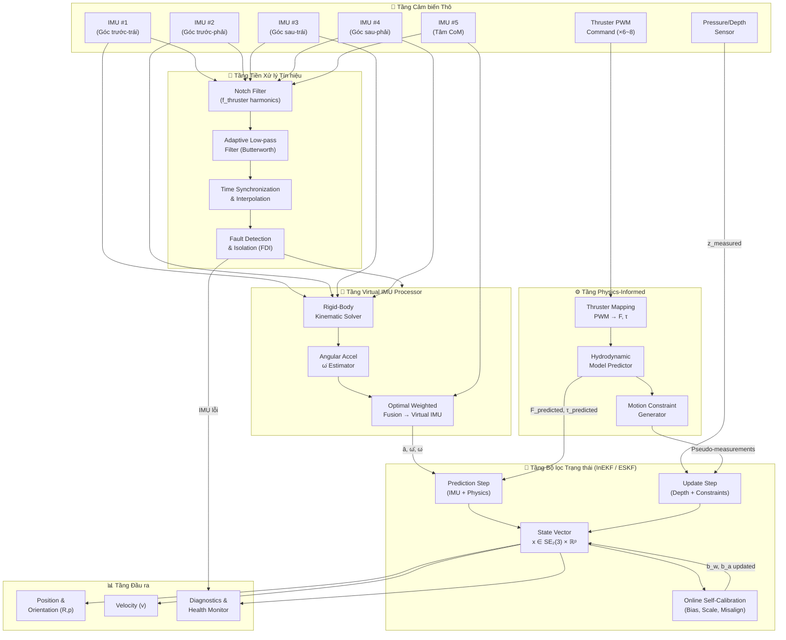
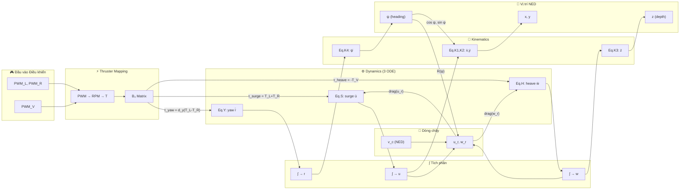
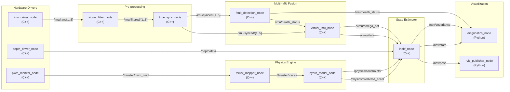
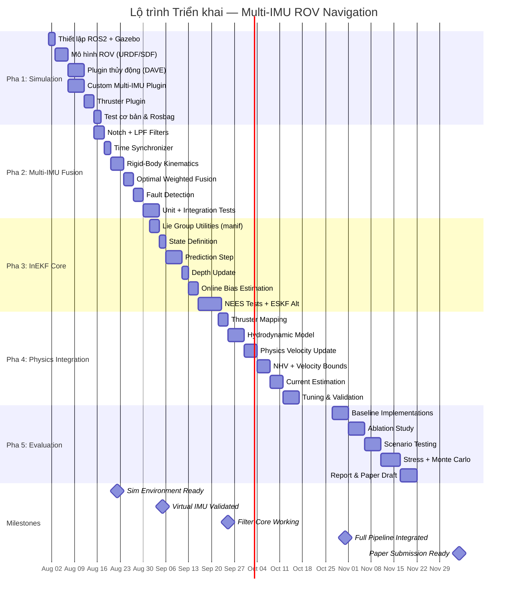

# Physics-informed Multi-IMU Navigation — Kế hoạch Triển khai Toàn diện

**Đề tài**: *"Physics-informed Multi-IMU Navigation with Online Self-Calibration and Motion Constraints for Underwater ROV Dead Reckoning without DVL and Sonar"*

---

# PHẦN 1: Cấu trúc Hệ thống & Kiến trúc Mô-đun

## 1.1. Sơ đồ Khối Luồng Dữ liệu (Data Pipeline)



### Giải thích luồng dữ liệu chính:

| Bước | Mô tả |
|------|--------|
| **①** | 5 tín hiệu IMU thô (mỗi IMU: 3-axis accel + 3-axis gyro = 6 kênh, tổng 30 kênh) đi qua bộ Notch Filter loại bỏ tần số rung cơ học do chân vịt |
| **②** | Adaptive LPF lọc nhiễu cao tần còn lại, sau đó đồng bộ thời gian (timestamp alignment) giữa 5 IMU |
| **③** | Fault Detection kiểm tra tính nhất quán dữ liệu giữa 5 IMU (Chi-squared test / Mahalanobis distance) |
| **④** | Virtual IMU Processor khai thác ràng buộc vật rắn để tính $\bar{\mathbf{a}}$, $\bar{\boldsymbol{\omega}}$, $\dot{\boldsymbol{\omega}}$ chất lượng cao |
| **⑤** | PWM → Thrust Mapping chuyển đổi tín hiệu điều khiển thành lực/mô-men, kết hợp với Mô hình Thủy động học để dự đoán trạng thái |
| **⑥** | InEKF/ESKF thực hiện Prediction (IMU + Physics) và Update (Depth + Motion Constraints) |
| **⑦** | Online Self-Calibration cập nhật bias, scale factor liên tục trong Vector trạng thái |

---

## 1.2. Thiết kế Khối Virtual IMU Processor

### 1.2.1. Bố trí Vật lý 5 IMU

```
          Y (Surge - Tiến lùi)
          ↑
   IMU#1 ●───────────● IMU#2
         │           │
         │   IMU#5   │
         │     ●     │ → X (Sway - Trái phải)
         │   (CoM)   │
         │           │
   IMU#3 ●───────────● IMU#4
```

Các lever arm vector (từ CoM đến vị trí IMU $i$) trong hệ tọa độ Body:

$$
\mathbf{r}_1 = \begin{bmatrix} -l_x \\ l_y \\ l_z \end{bmatrix}, \quad
\mathbf{r}_2 = \begin{bmatrix} l_x \\ l_y \\ l_z \end{bmatrix}, \quad
\mathbf{r}_3 = \begin{bmatrix} -l_x \\ -l_y \\ l_z \end{bmatrix}, \quad
\mathbf{r}_4 = \begin{bmatrix} l_x \\ -l_y \\ l_z \end{bmatrix}, \quad
\mathbf{r}_5 = \mathbf{0}_{3 \times 1}
$$

> [!NOTE]
> **Đã chốt: ROV tự phát triển (custom, không phải BlueROV2)**. Các giá trị $l_x, l_y, l_z$ phụ thuộc vào kích thước thực tế của khung ROV — con số $l_x \approx 0.18\text{m}$, $l_y \approx 0.11\text{m}$, $l_z \approx 0.04\text{m}$ dưới đây chỉ là **placeholder tham khảo theo tỉ lệ BlueROV2 Heavy**, dùng để code chạy được trong giai đoạn mô phỏng ban đầu. **Cần đo/trích xuất lại từ file CAD của ROV thật** (vị trí lắp 5 IMU trên khung, tọa độ CoM) trước khi chuyển sang Pha 3–4 (tuning filter) và Pha 5 (triển khai phần cứng), vì sai lệch lever arm ảnh hưởng trực tiếp đến độ chính xác của Rigid-Body Kinematic Solver (xem rủi ro **R9** ở Phần 5.1).

### 1.2.2. Phương trình Động học Vật rắn (Rigid-Body Kinematics)

Gia tốc đo được tại IMU thứ $i$ (sau khi trừ gravity trong body frame):

$$
\mathbf{a}_i^{\text{meas}} = \mathbf{a}_{\text{CoM}} + \dot{\boldsymbol{\omega}} \times \mathbf{r}_i + \boldsymbol{\omega} \times (\boldsymbol{\omega} \times \mathbf{r}_i) + \mathbf{b}_{a,i} + \mathbf{n}_{a,i}
$$

trong đó:
- $\mathbf{a}_{\text{CoM}}$: gia tốc tịnh tiến tại tâm khối lượng
- $\dot{\boldsymbol{\omega}}$: gia tốc góc (angular acceleration)
- $\boldsymbol{\omega}$: vận tốc góc (angular velocity)
- $\mathbf{r}_i$: lever arm vector từ CoM đến IMU $i$
- $\mathbf{b}_{a,i}$, $\mathbf{n}_{a,i}$: bias và nhiễu gia tốc kế

Gyroscope tại mọi vị trí trên vật rắn đo cùng một $\boldsymbol{\omega}$:

$$
\boldsymbol{\omega}_i^{\text{meas}} = \mathbf{R}_i^b \boldsymbol{\omega} + \mathbf{b}_{w,i} + \mathbf{n}_{w,i}
$$

trong đó $\mathbf{R}_i^b$ là ma trận quay từ hệ tọa độ IMU $i$ sang hệ tọa độ Body (phụ thuộc vào đặt hướng lắp đặt IMU, nếu các IMU lắp thẳng hàng thì $\mathbf{R}_i^b = \mathbf{I}_3$).

### 1.2.3. Giải thuật Ước lượng $\dot{\boldsymbol{\omega}}$ (Angular Acceleration) bằng Least-Squares

Viết lại phương trình gia tốc cho 4 IMU ngoại vi ($i = 1..4$) dưới dạng:

$$
\mathbf{a}_i^{\text{meas}} - \boldsymbol{\omega} \times (\boldsymbol{\omega} \times \mathbf{r}_i) = \mathbf{a}_{\text{CoM}} + [\mathbf{r}_i]_\times^T \dot{\boldsymbol{\omega}}
$$

Định nghĩa:
- $\tilde{\mathbf{a}}_i \triangleq \mathbf{a}_i^{\text{meas}} - \boldsymbol{\omega} \times (\boldsymbol{\omega} \times \mathbf{r}_i)$ (đã bù thành phần ly tâm)
- $[\mathbf{r}_i]_\times$ là skew-symmetric matrix của $\mathbf{r}_i$

Xếp chồng 4 phương trình thành hệ tuyến tính:

$$
\underbrace{\begin{bmatrix} \tilde{\mathbf{a}}_1 \\ \tilde{\mathbf{a}}_2 \\ \tilde{\mathbf{a}}_3 \\ \tilde{\mathbf{a}}_4 \end{bmatrix}}_{12 \times 1}
=
\underbrace{\begin{bmatrix} \mathbf{I}_3 & -[\mathbf{r}_1]_\times \\ \mathbf{I}_3 & -[\mathbf{r}_2]_\times \\ \mathbf{I}_3 & -[\mathbf{r}_3]_\times \\ \mathbf{I}_3 & -[\mathbf{r}_4]_\times \end{bmatrix}}_{\mathbf{H} \in \mathbb{R}^{12 \times 6}}
\underbrace{\begin{bmatrix} \mathbf{a}_{\text{CoM}} \\ \dot{\boldsymbol{\omega}} \end{bmatrix}}_{6 \times 1}
$$

Nghiệm Weighted Least-Squares:

$$
\begin{bmatrix} \hat{\mathbf{a}}_{\text{CoM}} \\ \hat{\dot{\boldsymbol{\omega}}} \end{bmatrix}
= (\mathbf{H}^T \mathbf{W} \mathbf{H})^{-1} \mathbf{H}^T \mathbf{W} \tilde{\mathbf{a}}
$$

trong đó $\mathbf{W} = \text{diag}(\sigma_{a,1}^{-2} \mathbf{I}_3, \ldots, \sigma_{a,4}^{-2} \mathbf{I}_3)$ là ma trận trọng số nghịch đảo phương sai nhiễu.

### 1.2.4. Gộp Virtual IMU (Optimal Weighted Fusion)

**Vận tốc góc Virtual IMU** (trung bình có trọng số):

$$
\bar{\boldsymbol{\omega}} = \left(\sum_{i=1}^{5} \mathbf{P}_{\omega,i}^{-1}\right)^{-1} \sum_{i=1}^{5} \mathbf{P}_{\omega,i}^{-1} \hat{\boldsymbol{\omega}}_i
$$

**Gia tốc Virtual IMU**: Kết hợp $\hat{\mathbf{a}}_{\text{CoM}}$ từ Least-Squares ở trên với phép đo IMU#5 (tại CoM):

$$
\bar{\mathbf{a}} = \alpha \hat{\mathbf{a}}_{\text{CoM}}^{(\text{LS})} + (1 - \alpha) \mathbf{a}_5^{\text{meas}}
$$

với $\alpha$ được tính từ hiệp phương sai tương đối:

$$
\alpha = \frac{\text{tr}(\mathbf{P}_{a,5})}{\text{tr}(\mathbf{P}_{a,\text{LS}}) + \text{tr}(\mathbf{P}_{a,5})}
$$

> [!IMPORTANT]
> **Lợi ích chính của Multi-IMU fusion**:
> - Giảm nhiễu trắng theo $1/\sqrt{N}$ (với $N=5$ → giảm ~$55\%$ so với 1 IMU)
> - Thu được $\dot{\boldsymbol{\omega}}$ trực tiếp mà **không cần đạo hàm số** (tránh bùng nổ nhiễu tần số cao)
> - Tăng khả năng phát hiện IMU lỗi qua kiểm tra tính nhất quán (consistency check)

### 1.2.5. Giải thuật Phát hiện IMU Lỗi (Fault Detection & Isolation)

**Phương pháp**: Generalized Likelihood Ratio Test (GLRT) dựa trên residual consistency.

Tính innovation residual cho mỗi IMU $i$:

$$
\mathbf{e}_i = \boldsymbol{\omega}_i^{\text{meas}} - \bar{\boldsymbol{\omega}}_{(-i)}
$$

trong đó $\bar{\boldsymbol{\omega}}_{(-i)}$ là trung bình có trọng số của các IMU **không bao gồm** IMU $i$.

**Tiêu chí loại bỏ (Chi-squared test)**:

$$
T_i = \mathbf{e}_i^T \mathbf{S}_i^{-1} \mathbf{e}_i \overset{?}{>} \chi^2_{3, \gamma}
$$

trong đó $\mathbf{S}_i = \mathbf{P}_{\omega,i} + \mathbf{P}_{\bar{\omega}_{(-i)}}$ là covariance của innovation, và $\gamma$ là ngưỡng xác suất (thường $\gamma = 0.001$ cho tỷ lệ false alarm $0.1\%$).

**Mã giả (Pseudocode)**:

```python
def fault_detection_isolation(omega_measurements: List[Vec3], 
                               P_omega: List[Mat3x3],
                               chi2_threshold: float = 16.27  # chi2_inv(0.999, 3)
                              ) -> Tuple[Vec3, List[bool]]:
    """
    Phát hiện và cô lập IMU lỗi, trả về omega_fused và mask IMU hợp lệ.
    """
    N = len(omega_measurements)
    valid_mask = [True] * N
    
    for i in range(N):
        # Tính trung bình có trọng số loại trừ IMU i
        omega_excl_i = weighted_mean_excluding(omega_measurements, P_omega, exclude=i)
        P_excl_i = fused_covariance_excluding(P_omega, exclude=i)
        
        # Innovation residual
        e_i = omega_measurements[i] - omega_excl_i
        S_i = P_omega[i] + P_excl_i
        
        # Chi-squared test statistic
        T_i = e_i.T @ np.linalg.inv(S_i) @ e_i
        
        if T_i > chi2_threshold:
            valid_mask[i] = False
            log_warning(f"IMU #{i} FAULT DETECTED: T={T_i:.2f} > threshold={chi2_threshold}")
    
    # Gộp chỉ các IMU hợp lệ
    omega_fused = weighted_mean(
        [omega_measurements[i] for i in range(N) if valid_mask[i]],
        [P_omega[i] for i in range(N) if valid_mask[i]]
    )
    
    return omega_fused, valid_mask
```

---

### 1.2.4. Chiến lược Song song: 5-IMU (Nghiên cứu lý thuyết) vs 2-IMU (Triển khai thực tế)

> [!IMPORTANT]
> **Đã chốt phạm vi**: Toàn bộ lý thuyết, thuật toán và mô phỏng trong tài liệu này được xây dựng và kiểm chứng đầy đủ trên cấu hình **5 IMU** (mô tả ở 1.2.1–1.2.3). Tuy nhiên, **triển khai thực tế trên phần cứng chỉ dùng 2 IMU**. Điều này có ảnh hưởng trực tiếp đến những gì có thể chứng minh/khai thác ở mỗi track:

| | **Track Lý thuyết / Mô phỏng (5 IMU)** | **Track Thực tế / Phần cứng (2 IMU)** |
|---|---|---|
| Mục đích | Chứng minh trần lý thuyết: Cramér-Rao Bound, hiệu quả Optimal Weighted Fusion, độ chính xác tối đa của $\dot{\boldsymbol{\omega}}$ estimator | Sản phẩm thực tế chạy trên ROV, ràng buộc bởi phần cứng/chi phí/không gian lắp đặt |
| Khả năng ước lượng $\dot{\boldsymbol{\omega}}$ | Đầy đủ (overdetermined, 4 IMU ngoại vi non-coplanar → Least-Squares ở 1.2.3) | **Không khả dụng trực tiếp** — theo bảng Graceful Degradation (5.2.2), với 2 IMU chỉ tính được $\bar{\boldsymbol{\omega}}$ (trung bình), **không** giải được $\dot{\boldsymbol{\omega}}$ bằng rigid-body kinematics (cần tối thiểu 3 IMU non-coplanar) |
| Virtual IMU Processor | Full pipeline (RIGID → OMEGA_DOT → MERGE, Phần 1.1/1.2) | Suy biến về **chế độ "Minimal"**: chỉ trung bình có trọng số $\bar{\mathbf{a}}, \bar{\boldsymbol{\omega}}$ giữa 2 IMU (không có $\dot{\boldsymbol{\omega}}$ từ kinematics); bù lại một phần bằng $\dot{\boldsymbol{\omega}}$ ước lượng gián tiếp từ đạo hàm số của $\boldsymbol{\omega}$ đo được hoặc từ mô hình physics (Phần Physics-Informed) |
| State vector | 42-dim đầy đủ (bias riêng từng IMU, đã chốt giữ nguyên — xem 2.2) — dùng để đánh giá lý thuyết | Có thể cần **thu gọn phần bias** tương ứng với 2 IMU thực tế thay vì 5 (state vector con, không phải bỏ full 42-dim mà là subset áp dụng cho số IMU thực có) |
| Vai trò trong đồ án/paper | Kết quả benchmarking, ablation study (Pha 5) dùng cấu hình 5 IMU làm "upper bound" tham chiếu | Kết quả demo thực nghiệm, so sánh sim-to-real gap: hiệu năng 2-IMU thực tế so với "trần" lý thuyết 5-IMU |

**Hệ quả cần lưu ý khi triển khai:**
1. Pha 1–2 (mô phỏng) vẫn giữ nguyên 5 IMU ảo trong Gazebo để nghiên cứu đầy đủ thuật toán và xác lập baseline lý thuyết.
2. Song song hoặc ở cuối Pha 2/đầu Pha 3, cần chạy thêm **kịch bản mô phỏng với chỉ 2 IMU** (bằng cách tắt 3 IMU ảo, hoặc scale-down trực tiếp) để kiểm chứng thuật toán ở chế độ suy biến này *trước khi* đưa lên phần cứng thật — tránh trường hợp thuật toán chỉ hoạt động tốt với 5 IMU nhưng thất bại với 2 IMU thực tế.
3. Vị trí lắp đặt 2 IMU thực tế trên ROV (ví dụ: đặt lệch nhau một khoảng lever-arm đủ lớn, không đặt trùng CoM) ảnh hưởng đến chất lượng $\bar{\boldsymbol{\omega}}$ trung bình — cần xác định cụ thể khi có## 2.1. Mô hình Động lực học 3-DOF (Surge, Heave, Yaw)

> [!IMPORTANT]
> **Mô hình 3-DOF rút gọn** dưới đây thay thế mô hình Fossen 6-DOF tổng quát, được thiết kế riêng cho cấu hình phần cứng ROV custom của team:
> - **3 DOF giữ lại**: Surge ($u$), Heave ($w$), Yaw ($r$)
> - **3 DOF loại bỏ**: Sway ($v \approx 0$), Roll ($p \approx 0$), Pitch ($q \approx 0$)
> - **Thruster**: 2 ngang phía sau (differential drive) + 1 dọc tổng hợp gần CG
> - **Hệ tọa độ**: NED (chuẩn Fossen/hàng hải)

### 2.1.1. Giả thiết Đơn giản hóa & Rút gọn từ 6-DOF

Xuất phát từ phương trình Fossen 6-DOF tổng quát:

$$
\mathbf{M} \dot{\boldsymbol{\nu}} + \mathbf{C}(\boldsymbol{\nu})\boldsymbol{\nu} + \mathbf{D}(\boldsymbol{\nu})\boldsymbol{\nu} + \mathbf{g}(\boldsymbol{\eta}) = \boldsymbol{\tau}
$$

với $\boldsymbol{\nu} = [u, v, w, p, q, r]^T$ và $\boldsymbol{\eta} = [x, y, z, \phi, \theta, \psi]^T$, chúng ta áp dụng **ba giả thiết** để rút gọn:

**Giả thiết H1 — Ổn định Roll/Pitch (Metacentric Stability)**:

$$
\boxed{\phi \approx 0, \quad \theta \approx 0, \quad p \approx 0, \quad q \approx 0}
$$

*Cơ sở vật lý*: ROV có tâm trọng lực (CG) nằm **dưới** tâm nổi (CB) theo trục $z$ body ($z_G > z_B$ trong NED, tức CG thấp hơn CB trong không gian vật lý). Khoảng cách $\overline{BG} = z_G - z_B > 0$ tạo moment hồi phục metacentric mạnh, giữ ROV ổn định roll/pitch tự nhiên. Điều kiện này tương đương chiều cao metacentric $\overline{GM} > 0$:

$$
\tau_{\text{restoring, roll}} = -(z_G W - z_B B)\sin\phi \approx -(z_G - z_B) W \cdot \phi \quad (\text{linearized})
$$

**Giả thiết H2 — Không trượt ngang (No Sway)**:

$$
\boxed{v \approx 0}
$$

*Cơ sở vật lý*: ROV không có thruster tạo lực ngang trực tiếp. Lực ngang duy nhất đến từ (i) Coriolis coupling $-mur$ khi quay+tiến, và (ii) dòng chảy ngang. Trong điều kiện hoạt động bình thường (vận tốc thấp, dòng chảy yếu), $v$ nhỏ đủ để bỏ qua. Constraint NHV (Phần 2.3.4a) sẽ bổ sung enforce điều kiện này trong bộ lọc.

**Giả thiết H3 — Ma trận Added Mass chéo (Diagonal Added Mass)**:

$$
\boxed{\mathbf{M}_A = -\text{diag}(X_{\dot{u}}, Y_{\dot{v}}, Z_{\dot{w}}, K_{\dot{p}}, M_{\dot{q}}, N_{\dot{r}})}
$$

*Cơ sở vật lý*: ROV có dạng hình học gần đối xứng qua ít nhất hai mặt phẳng ($xz$ và $yz$), nên các hệ số added mass chéo (cross-coupling) nhỏ đủ để bỏ qua.

**Quy trình rút gọn**: Đặt $v = p = q = \phi = \theta = 0$ vào tất cả các ma trận 6-DOF, sau đó trích xuất các hàng/cột tương ứng với DOF $\{1, 3, 6\}$ (surge, heave, yaw).

### 2.1.2. Biến Trạng thái & Ký hiệu 3-DOF

**Vector vận tốc Body-fixed** (3 biến động lực học):

$$
\boldsymbol{\nu}_3 = \begin{bmatrix} u \\ w \\ r \end{bmatrix} \in \mathbb{R}^3
$$

| Ký hiệu | Tên | DOF | Đơn vị |
|----------|-----|-----|--------|
| $u$ | Vận tốc surge (tiến/lùi) | Tịnh tiến trục $x_b$ | m/s |
| $w$ | Vận tốc heave (lên/xuống) | Tịnh tiến trục $z_b$ | m/s |
| $r$ | Vận tốc yaw (quay đầu) | Quay quanh trục $z_b$ | rad/s |

**Vector vị trí Earth-fixed (NED)** (4 biến động học):

$$
\boldsymbol{\eta}_3 = \begin{bmatrix} x \\ y \\ z \\ \psi \end{bmatrix} \in \mathbb{R}^4
$$

| Ký hiệu | Tên | Đơn vị |
|----------|-----|--------|
| $x$ | Vị trí North | m |
| $y$ | Vị trí East | m |
| $z$ | Vị trí Down (Depth) | m |
| $\psi$ | Góc Yaw (Heading) | rad |

**Ký hiệu lực/moment tổng hợp tác dụng lên ROV** (3-DOF):

$$
\boldsymbol{\tau}_3 = \begin{bmatrix} \tau_{\text{surge}} \\ \tau_{\text{heave}} \\ \tau_{\text{yaw}} \end{bmatrix} = \begin{bmatrix} X \\ Z \\ N \end{bmatrix} \in \mathbb{R}^3
$$

### 2.1.3. Phương trình Động lực học 3-DOF — Dạng Ma trận

$$
\boxed{
\mathbf{M}_3 \dot{\boldsymbol{\nu}}_3 + \mathbf{C}_3(\boldsymbol{\nu}_3)\boldsymbol{\nu}_3 + \mathbf{D}_3(\boldsymbol{\nu}_3)\boldsymbol{\nu}_3 + \mathbf{g}_3 = \boldsymbol{\tau}_3
}
$$

Dưới đây trình bày chi tiết **từng thành phần** của phương trình.

---

#### a) Ma trận Khối lượng Tổng hợp $\mathbf{M}_3$ (Inertia + Added Mass)

$$
\mathbf{M}_3 = \mathbf{M}_{RB,3} + \mathbf{M}_{A,3}
$$

**Rút gọn $\mathbf{M}_{RB}$ 6-DOF → 3-DOF:**

Với giả thiết $\mathbf{r}_G = [0, 0, z_G]^T$ (CG nằm trên trục $z$ body — ROV đối xứng ngang), tensor quán tính $\mathbf{I}_b = \text{diag}(I_{xx}, I_{yy}, I_{zz})$ (tích quán tính ≈ 0 do đối xứng), ma trận rigid-body 6-DOF đầy đủ là:

$$
\mathbf{M}_{RB} = \begin{bmatrix}
m & 0 & 0 & 0 & mz_G & 0 \\
0 & m & 0 & -mz_G & 0 & 0 \\
0 & 0 & m & 0 & 0 & 0 \\
0 & -mz_G & 0 & I_{xx} & 0 & 0 \\
mz_G & 0 & 0 & 0 & I_{yy} & 0 \\
0 & 0 & 0 & 0 & 0 & I_{zz}
\end{bmatrix}
$$

Trích xuất hàng/cột $\{1, 3, 6\}$ (surge, heave, yaw):

$$
\mathbf{M}_{RB,3} = \begin{bmatrix}
M_{RB}(1,1) & M_{RB}(1,3) & M_{RB}(1,6) \\
M_{RB}(3,1) & M_{RB}(3,3) & M_{RB}(3,6) \\
M_{RB}(6,1) & M_{RB}(6,3) & M_{RB}(6,6)
\end{bmatrix} = \begin{bmatrix}
m & 0 & 0 \\
0 & m & 0 \\
0 & 0 & I_{zz}
\end{bmatrix}
$$

> [!NOTE]
> **Coupling $mz_G$ triệt tiêu trong 3-DOF**: Thành phần $mz_G$ chỉ xuất hiện ở coupling surge↔pitch $(M_{RB}(1,5))$ và sway↔roll $(M_{RB}(2,4))$ — cả hai đều thuộc các DOF đã bị loại bỏ. Do đó $\mathbf{M}_{RB,3}$ là **chéo**, không có coupling khối lượng giữa surge, heave, yaw.

**Ma trận Added Mass 3-DOF** (trích từ $\mathbf{M}_A$ chéo, lấy DOF $\{1, 3, 6\}$):

$$
\mathbf{M}_{A,3} = -\text{diag}(X_{\dot{u}}, Z_{\dot{w}}, N_{\dot{r}})
$$

Các hệ số $X_{\dot{u}}, Z_{\dot{w}}, N_{\dot{r}}$ đều **âm** theo quy ước Fossen, nên $-X_{\dot{u}} > 0$.

**Ma trận khối lượng tổng hợp 3-DOF**:

$$
\boxed{
\mathbf{M}_3 = \begin{bmatrix}
m - X_{\dot{u}} & 0 & 0 \\
0 & m - Z_{\dot{w}} & 0 \\
0 & 0 & I_{zz} - N_{\dot{r}}
\end{bmatrix}
}
$$

> [!IMPORTANT]
> $\mathbf{M}_3$ là **chéo và xác định dương**, nghĩa là:
> - Mỗi DOF có quán tính riêng, **không** coupling khối lượng
> - $\mathbf{M}_3$ khả nghịch: $\mathbf{M}_3^{-1} = \text{diag}\!\left(\frac{1}{m - X_{\dot{u}}}, \frac{1}{m - Z_{\dot{w}}}, \frac{1}{I_{zz} - N_{\dot{r}}}\right)$
> - Added mass ($-X_{\dot{u}}, -Z_{\dot{w}}, -N_{\dot{r}}$) **tăng** quán tính hiệu dụng ⇒ ROV phản ứng chậm hơn trong nước so với trong không khí

**Bảng giá trị tham khảo** (placeholder — cần cập nhật từ CFD/thực nghiệm cho ROV custom):

| Tham số | Ý nghĩa | Giá trị ước lượng | Đơn vị |
|---------|---------|-------------------|--------|
| $m$ | Khối lượng ROV | 11.5 | kg |
| $I_{zz}$ | Moment quán tính yaw | 0.35 | kg·m² |
| $X_{\dot{u}}$ | Added mass surge | −5.5 | kg |
| $Z_{\dot{w}}$ | Added mass heave | −14.6 | kg |
| $N_{\dot{r}}$ | Added mass yaw | −0.12 | kg·m²/rad |

---

#### b) Ma trận Coriolis-Centripetal $\mathbf{C}_3$ — Chứng minh Triệt tiêu

**Mệnh đề**: *Với giả thiết H1–H3 ($v = p = q = 0$, $\mathbf{r}_G = [0,0,z_G]^T$, $\mathbf{M}_A$ chéo), ma trận Coriolis-centripetal rút gọn cho DOF $\{u, w, r\}$ triệt tiêu hoàn toàn:*

$$
\boxed{\mathbf{C}_3(\boldsymbol{\nu}_3) \equiv \mathbf{0}_{3 \times 3}}
$$

**Chứng minh cho $\mathbf{C}_{RB,3}$:**

Đặt $\boldsymbol{\nu}_1 = [u, 0, w]^T$, $\boldsymbol{\nu}_2 = [0, 0, r]^T$, $\mathbf{r}_G = [0, 0, z_G]^T$.

Tính $[\boldsymbol{\nu}_2]_\times \mathbf{r}_G$:

$$
[\boldsymbol{\nu}_2]_\times \mathbf{r}_G = \begin{bmatrix} 0 & -r & 0 \\ r & 0 & 0 \\ 0 & 0 & 0 \end{bmatrix} \begin{bmatrix} 0 \\ 0 \\ z_G \end{bmatrix} = \begin{bmatrix} 0 \\ 0 \\ 0 \end{bmatrix}
$$

Định nghĩa $\mathbf{a} \triangleq \boldsymbol{\nu}_1 + [\boldsymbol{\nu}_2]_\times \mathbf{r}_G = [u, 0, w]^T$ và viết $\mathbf{C}_{RB}$ 6-DOF:

$$
\mathbf{C}_{RB} = \begin{bmatrix} \mathbf{0}_3 & -m[\mathbf{a}]_\times \\ -m[\mathbf{a}]_\times & -[\mathbf{I}_b \boldsymbol{\nu}_2]_\times \end{bmatrix}
$$

Khai triển skew-symmetric:

$$
[\mathbf{a}]_\times = \begin{bmatrix} 0 & -w & 0 \\ w & 0 & -u \\ 0 & u & 0 \end{bmatrix}, \quad
\mathbf{I}_b \boldsymbol{\nu}_2 = \begin{bmatrix} 0 \\ 0 \\ I_{zz} r \end{bmatrix}
$$

$$
-m[\mathbf{a}]_\times = m\begin{bmatrix} 0 & w & 0 \\ -w & 0 & u \\ 0 & -u & 0 \end{bmatrix}, \quad
-[\mathbf{I}_b \boldsymbol{\nu}_2]_\times = \begin{bmatrix} 0 & I_{zz}r & 0 \\ -I_{zz}r & 0 & 0 \\ 0 & 0 & 0 \end{bmatrix}
$$

Ma trận $\mathbf{C}_{RB}$ 6×6 đầy đủ (đánh dấu vị trí DOF):

$$
\mathbf{C}_{RB} = \begin{array}{c|cccccc}
& u & v & w & p & q & r \\ \hline
u & 0 & 0 & 0 & 0 & mw & 0 \\
v & 0 & 0 & 0 & -mw & 0 & mu \\
w & 0 & 0 & 0 & 0 & -mu & 0 \\
p & 0 & mw & 0 & 0 & I_{zz}r & 0 \\
q & -mw & 0 & mu & -I_{zz}r & 0 & 0 \\
r & 0 & -mu & 0 & 0 & 0 & 0
\end{array}
$$

Trích xuất hàng/cột $\{1, 3, 6\}$:

$$
\mathbf{C}_{RB,3} = \begin{bmatrix}
C_{RB}(u,u) & C_{RB}(u,w) & C_{RB}(u,r) \\
C_{RB}(w,u) & C_{RB}(w,w) & C_{RB}(w,r) \\
C_{RB}(r,u) & C_{RB}(r,w) & C_{RB}(r,r)
\end{bmatrix} = \begin{bmatrix}
0 & 0 & 0 \\
0 & 0 & 0 \\
0 & 0 & 0
\end{bmatrix} \quad \blacksquare
$$

**Chứng minh cho $\mathbf{C}_{A,3}$** (tương tự):

Với $\mathbf{M}_A$ chéo, đặt $\mathbf{a}_1 = [-X_{\dot{u}} u, 0, -Z_{\dot{w}} w]^T$ (trích DOF tịnh tiến), $\mathbf{a}_2 = [0, 0, -N_{\dot{r}} r]^T$ (trích DOF quay):

$$
\mathbf{C}_A = \begin{bmatrix} \mathbf{0}_3 & -[\mathbf{a}_1]_\times \\ -[\mathbf{a}_1]_\times & -[\mathbf{a}_2]_\times \end{bmatrix}
$$

Khai triển và trích DOF $\{1, 3, 6\}$ → mọi phần tử $C_A(u,u)$, $C_A(u,w)$, $C_A(u,r)$, $\ldots$, $C_A(r,r)$ đều bằng **0**. (Quá trình tính toán hoàn toàn tương tự $\mathbf{C}_{RB}$ ở trên.)

$$
\mathbf{C}_{A,3} = \mathbf{0}_{3 \times 3} \quad \blacksquare
$$

> [!TIP]
> **Ý nghĩa vật lý**: Lực Coriolis do yaw rotation ($r$) tác dụng lên thành phần surge ($u$) tạo ra lực hướng **sway** ($\mathbf{F}_{\text{Coriolis}} = -m \boldsymbol{\omega} \times \mathbf{v} = -m[0,0,r]^T \times [u,0,w]^T = [0, -mru, 0]^T$), tức lực hoàn toàn nằm trong mặt phẳng ngang và hướng sang bên. Vì chúng ta đã loại bỏ sway khỏi mô hình, lực Coriolis **không xuất hiện** trong bất kỳ phương trình 3-DOF nào. Điều này đơn giản hóa đáng kể mô hình mà không mất tính chính xác vật lý.

---

#### c) Ma trận Damping $\mathbf{D}_3$ (Lực cản Thủy động)

$$
\mathbf{D}_3(\boldsymbol{\nu}_3) = \mathbf{D}_{l,3} + \mathbf{D}_{q,3}(\boldsymbol{\nu}_3)
$$

**Damping tuyến tính** (skin friction, chiếm ưu thế ở vận tốc thấp):

$$
\mathbf{D}_{l,3} = \begin{bmatrix}
-X_u & 0 & 0 \\
0 & -Z_w & 0 \\
0 & 0 & -N_r
\end{bmatrix}
$$

**Damping bậc hai** (form/pressure drag, chiếm ưu thế ở vận tốc cao):

$$
\mathbf{D}_{q,3}(\boldsymbol{\nu}_3) = \begin{bmatrix}
-X_{u|u|}|u_r| & 0 & 0 \\
0 & -Z_{w|w|}|w_r| & 0 \\
0 & 0 & -N_{r|r|}|r|
\end{bmatrix}
$$

**Tích $\mathbf{D}_3(\boldsymbol{\nu}_3)\boldsymbol{\nu}_3$ khai triển:**

$$
\mathbf{D}_3(\boldsymbol{\nu}_3)\boldsymbol{\nu}_3 = \begin{bmatrix}
(-X_u - X_{u|u|}|u_r|) \cdot u_r \\
(-Z_w - Z_{w|w|}|w_r|) \cdot w_r \\
(-N_r - N_{r|r|}|r|) \cdot r
\end{bmatrix}
$$

trong đó $u_r, w_r$ là **vận tốc tương đối so với nước** (xem mục 2.1.7).

> [!NOTE]
> Vì $X_u, Z_w, N_r, X_{u|u|}, Z_{w|w|}, N_{r|r|}$ đều **âm** theo quy ước Fossen:
> - $-X_u > 0$ → drag luôn **cản trở** chuyển động
> - Tổng lực cản tỉ lệ với $u_r + |u_r|u_r$ → phi tuyến bậc hai, tăng nhanh theo vận tốc
> - **Cross-coupling damping** ($X_{wr}, Z_{ur}$, ...) được bỏ qua cho ROV đối xứng; có thể bổ sung các phần tử off-diagonal nếu dữ liệu CFD/thực nghiệm cho thấy coupling đáng kể

**Bảng giá trị tham khảo** (placeholder):

| Tham số | Ý nghĩa | Giá trị ước lượng | Đơn vị |
|---------|---------|-------------------|--------|
| $X_u$ | Damping tuyến tính surge | −4.03 | Ns/m |
| $X_{u|u|}$ | Damping bậc hai surge | −18.18 | Ns²/m² |
| $Z_w$ | Damping tuyến tính heave | −11.17 | Ns/m |
| $Z_{w|w|}$ | Damping bậc hai heave | −36.99 | Ns²/m² |
| $N_r$ | Damping tuyến tính yaw | −0.07 | Nms/rad |
| $N_{r|r|}$ | Damping bậc hai yaw | −1.55 | Nms²/rad² |

---

#### d) Vector Lực Hồi phục $\mathbf{g}_3$ (Gravity + Buoyancy)

Với $\phi = 0$, $\theta = 0$, vector lực hồi phục 6-DOF đơn giản hóa thành:

$$
\mathbf{g}(\boldsymbol{\eta})\Big|_{\phi=\theta=0} = \begin{bmatrix}
0 \\ 0 \\ -(W - B) \\ -(y_G W - y_B B) \\ (x_G W - x_B B) \\ 0
\end{bmatrix}
$$

Trích DOF $\{1, 3, 6\}$:

$$
\boxed{
\mathbf{g}_3 = \begin{bmatrix} 0 \\ -(W - B) \\ 0 \end{bmatrix}
}
$$

trong đó:
- $W = mg$ — trọng lượng trong nước (N)
- $B = \rho_w g \nabla$ — lực nổi Archimedes (N), $\nabla$ = thể tích ROV chiếm chỗ

**Phân tích trường hợp:**

| Điều kiện | $g_3(2) = -(W-B)$ | Ý nghĩa |
|-----------|:------------------:|---------|
| $W > B$ (buoyancy âm) | $< 0$ | ROV chìm tự do → cần thruster đẩy **lên** để hover |
| $W = B$ (trung tính) | $= 0$ | Trôi tự do → hover không tốn năng lượng |
| $W < B$ (buoyancy dương) | $> 0$ | ROV nổi tự do → cần thruster đẩy **xuống** để hover |

> [!NOTE]
> - Thành phần surge ($g_{3,1} = 0$): Không có lực hồi phục theo phương ngang khi $\theta = 0$
> - Thành phần yaw ($g_{3,3} = 0$): Không có moment hồi phục yaw khi CG và CB cùng nằm trên trục $z$ body ($x_G = x_B = 0$, $y_G = y_B = 0$)

### 2.1.4. Phương trình Scalar từng DOF — Khai triển Chi tiết

Từ dạng ma trận $\mathbf{M}_3 \dot{\boldsymbol{\nu}}_3 + \mathbf{D}_3 \boldsymbol{\nu}_3 + \mathbf{g}_3 = \boldsymbol{\tau}_3$ (nhớ rằng $\mathbf{C}_3 \equiv \mathbf{0}$), khai triển thành **ba phương trình vi phân bậc nhất phi tuyến liên lập**:

---

**⟨Phương trình 1 — SURGE⟩**

$$
\boxed{
(m - X_{\dot{u}}) \dot{u} = \underbrace{X_u \cdot u_r + X_{u|u|} |u_r| \cdot u_r}_{\text{Lực cản thủy động (drag)}} + \underbrace{T_L + T_R}_{\text{Lực đẩy thruster}}
}
\tag{Eq.S}
$$

*Giải thích*:
- Vế trái: khối lượng hiệu dụng $(m - X_{\dot{u}})$ nhân gia tốc surge
- $X_u u_r$: drag tuyến tính (âm, cản trở chuyển động)
- $X_{u|u|} |u_r| u_r$: drag bậc hai (âm, tăng nhanh theo $u_r^2$)
- $T_L + T_R$: tổng lực đẩy từ cả 2 thruster ngang (cùng chiều = tiến, ngược chiều = quay)

---

**⟨Phương trình 2 — HEAVE⟩**

$$
\boxed{
(m - Z_{\dot{w}}) \dot{w} = \underbrace{Z_w \cdot w_r + Z_{w|w|} |w_r| \cdot w_r}_{\text{Lực cản thủy động}} + \underbrace{(W - B)}_{\text{Chênh lệch trọng lực - nổi}} + \underbrace{(-T_V)}_{\text{Lực đẩy thruster dọc}}
}
\tag{Eq.H}
$$

*Giải thích*:
- $(W - B)$: nếu ROV nặng hơn nước → dương → đẩy ROV xuống (NED: +$z$ = down)
- $-T_V$: thruster dọc đẩy ROV **lên** (−$z$) khi $T_V > 0$, nên đóng góp $-T_V$ vào lực heave
- Tại hover ($\dot{w} = 0$, $w_r = 0$): $T_V = W - B$ (thruster bù chính xác lực chìm/nổi)

---

**⟨Phương trình 3 — YAW⟩**

$$
\boxed{
(I_{zz} - N_{\dot{r}}) \dot{r} = \underbrace{N_r \cdot r + N_{r|r|} |r| \cdot r}_{\text{Moment cản thủy động}} + \underbrace{d_y (T_L - T_R)}_{\text{Moment quay từ differential thrust}}
}
\tag{Eq.Y}
$$

*Giải thích*:
- $(I_{zz} - N_{\dot{r}})$: moment quán tính hiệu dụng (bao gồm added mass quay)
- $N_r r$: moment cản tuyến tính yaw (âm, cản quay)
- $d_y (T_L - T_R)$: moment yaw tạo bởi chênh lệch lực giữa thruster trái và phải, cánh tay moment $d_y$ là khoảng cách ngang từ mỗi thruster đến mặt phẳng đối xứng $xz$

> [!IMPORTANT]
> **Coupling giữa các phương trình thông qua thruster**:
> - $T_L$ và $T_R$ xuất hiện **đồng thời** trong cả Eq.S (tổng) và Eq.Y (hiệu) → **surge và yaw được liên kết chặt chẽ qua cơ chế differential drive**
> - $T_V$ chỉ xuất hiện trong Eq.H → **heave tách biệt** về mặt điều khiển
> - Tuy nhiên, ba phương trình **liên kết gián tiếp** qua kinematics: $u$ và $\psi$ (từ $r$) cùng ảnh hưởng đến vị trí $(x, y)$ trong hệ NED (xem 2.1.6)

### 2.1.5. Cấu hình Thruster & Thruster Allocation Matrix $\mathbf{B}_3$

#### Sơ đồ Bố trí Thruster

```
     Nhìn từ trên xuống (Top View)
     Hệ tọa độ Body: x_b → tiến (surge), y_b → phải (sway)

          ← d_y → ← d_y →
                    
           x_b (surge)
            ↑
            |
     ┌──────┼──────┐
     │      |      │
     │   CG ● ──→ y_b (sway)
     │      |      │
     │      |      │
     └──┬───┼───┬──┘
        │   |   │
   ←── T_L  |  T_R ──→     ← hướng đẩy (+x_b)
        │   |   │
        ↓   ↓   ↓
            l_x
            
    Nhìn từ bên (Side View)

          x_b (surge) →
     ┌──────────────────┐
     │   CB ○            │
     │          T_V ↑    │ ← thruster dọc, đẩy lên (-z_b)
     │   CG ●            │
     └──────────────────┘
            ↓ z_b (heave)
```

#### Vị trí Thruster so với CG (Body Frame)

| Thruster | Vị trí $\mathbf{r}_j$ (so với CG) | Hướng đẩy $\mathbf{e}_j$ |
|----------|:---:|:---:|
| $T_L$ (trái, sau) | $[-l_x, \; -d_y, \; 0]^T$ | $[1, \; 0, \; 0]^T$ (tiến) |
| $T_R$ (phải, sau) | $[-l_x, \; +d_y, \; 0]^T$ | $[1, \; 0, \; 0]^T$ (tiến) |
| $T_V$ (dọc, gần CG) | $[\approx 0, \; 0, \; z_t]^T$ | $[0, \; 0, \; -1]^T$ (lên) |

Trong đó:
- $l_x$: khoảng cách dọc từ CG đến thruster ngang (m)
- $d_y$: khoảng cách ngang từ thruster đến mặt phẳng $xz$ (m)
- $z_t$: offset dọc của thruster vertical so với CG (m), thường nhỏ

#### Tính Lực & Moment từ mỗi Thruster

**Lực** (trực tiếp): $\mathbf{F}_j = T_j \cdot \mathbf{e}_j$

**Moment** (tích chéo): $\boldsymbol{\mu}_j = \mathbf{r}_j \times \mathbf{F}_j$

Tính cho từng thruster:

$$
\boldsymbol{\mu}_L = \mathbf{r}_L \times T_L \mathbf{e}_L = T_L \begin{bmatrix} -l_x \\ -d_y \\ 0 \end{bmatrix} \times \begin{bmatrix} 1 \\ 0 \\ 0 \end{bmatrix} = T_L \begin{bmatrix} 0 \\ 0 \\ +d_y \end{bmatrix}
$$

$$
\boldsymbol{\mu}_R = \mathbf{r}_R \times T_R \mathbf{e}_R = T_R \begin{bmatrix} -l_x \\ +d_y \\ 0 \end{bmatrix} \times \begin{bmatrix} 1 \\ 0 \\ 0 \end{bmatrix} = T_R \begin{bmatrix} 0 \\ 0 \\ -d_y \end{bmatrix}
$$

$$
\boldsymbol{\mu}_V = \mathbf{r}_V \times T_V \mathbf{e}_V = T_V \begin{bmatrix} 0 \\ 0 \\ z_t \end{bmatrix} \times \begin{bmatrix} 0 \\ 0 \\ -1 \end{bmatrix} = T_V \begin{bmatrix} 0 \\ 0 \\ 0 \end{bmatrix} \approx \mathbf{0}
$$

(Thruster dọc đặt gần CG → moment ≈ 0; nếu $\mathbf{r}_V = [x_v, 0, z_t]^T$ với $x_v \neq 0$ thì $\mu_{V,y} = -x_v T_V$ sẽ tạo moment pitch nhỏ, nhưng bỏ qua do $x_v \approx 0$.)

#### Tổng hợp → Thruster Allocation Matrix

$$
\boldsymbol{\tau}_3 = \mathbf{B}_3 \mathbf{T}_3
$$

$$
\begin{bmatrix} \tau_{\text{surge}} \\ \tau_{\text{heave}} \\ \tau_{\text{yaw}} \end{bmatrix}
=
\underbrace{\begin{bmatrix}
1 & 1 & 0 \\
0 & 0 & -1 \\
d_y & -d_y & 0
\end{bmatrix}}_{\mathbf{B}_3 \in \mathbb{R}^{3 \times 3}}
\begin{bmatrix} T_L \\ T_R \\ T_V \end{bmatrix}
$$

$$
\boxed{
\mathbf{B}_3 = \begin{bmatrix}
1 & 1 & 0 \\
0 & 0 & -1 \\
d_y & -d_y & 0
\end{bmatrix}
}
$$

**Tính chất quan trọng**:

$$
\det(\mathbf{B}_3) = 1 \cdot (0 \cdot 0 - (-1)(-d_y)) - 1 \cdot (0 \cdot 0 - (-1) \cdot d_y) + 0 = -d_y - d_y = -2d_y
$$

- Vì $d_y > 0$: $\det(\mathbf{B}_3) = -2d_y \neq 0$ → $\mathbf{B}_3$ **khả nghịch**
- **Hệ thống fully actuated trong 3-DOF**: có thể tạo bất kỳ tổ hợp $[\tau_{\text{surge}}, \tau_{\text{heave}}, \tau_{\text{yaw}}]$ nào trong giới hạn lực thruster

**Ma trận nghịch đảo** (dùng cho inverse allocation — tính thrust cần thiết từ lực/moment mong muốn):

$$
\mathbf{B}_3^{-1} = \frac{1}{2} \begin{bmatrix}
1 & 0 & 1/d_y \\
1 & 0 & -1/d_y \\
0 & -2 & 0
\end{bmatrix}
$$

Kiểm tra: $T_L = \frac{1}{2}(\tau_{\text{surge}} + \frac{\tau_{\text{yaw}}}{d_y})$, $T_R = \frac{1}{2}(\tau_{\text{surge}} - \frac{\tau_{\text{yaw}}}{d_y})$, $T_V = -\tau_{\text{heave}}$ ✓

#### Ánh xạ PWM → Lực đẩy (Thrust Mapping)

**Bước 1**: PWM → RPM:
$$
n_j = f_{\text{esc}}(\text{PWM}_j) \quad [\text{rev/s}]
$$

**Bước 2**: RPM → Lực đẩy (mô hình bậc hai bất đối xứng):
$$
T_j = \begin{cases}
K_{T,+} \rho D^4 n_j |n_j| & \text{nếu } n_j \geq 0 \quad \text{(tiến)} \\
K_{T,-} \rho D^4 n_j |n_j| & \text{nếu } n_j < 0 \quad \text{(lùi)}
\end{cases}
$$

trong đó $K_{T,\pm}$ là hệ số lực đẩy, $\rho$ mật độ nước, $D$ đường kính chân vịt.

> [!NOTE]
> Các giá trị $l_x, d_y, K_{T,\pm}$ là **placeholder** — cần đo từ CAD/thiết kế thực tế của ROV custom (xem rủi ro **R9** ở Phần 5.1). Giá trị ước lượng ban đầu: $l_x \approx 0.15$ m, $d_y \approx 0.12$ m.

### 2.1.6. Phương trình Động học (Kinematics) 3-DOF

Kinematics liên kết **vận tốc body-fixed** ($\boldsymbol{\nu}_3$) với **đạo hàm vị trí earth-fixed** ($\dot{\boldsymbol{\eta}}_3$).

Với $\phi = 0$, $\theta = 0$, $v = 0$, ma trận quay NED→Body giảm về quay thuần yaw:

$$
\mathbf{R}(\psi) = \begin{bmatrix}
\cos\psi & -\sin\psi & 0 \\
\sin\psi & \cos\psi & 0 \\
0 & 0 & 1
\end{bmatrix}
$$

**Phương trình động học đầy đủ**:

$$
\boxed{
\dot{\boldsymbol{\eta}}_3 = \mathbf{J}_3(\psi) \boldsymbol{\nu}_3
}
$$

$$
\begin{bmatrix} \dot{x} \\ \dot{y} \\ \dot{z} \\ \dot{\psi} \end{bmatrix}
=
\underbrace{\begin{bmatrix}
\cos\psi & 0 & 0 \\
\sin\psi & 0 & 0 \\
0 & 1 & 0 \\
0 & 0 & 1
\end{bmatrix}}_{\mathbf{J}_3(\psi) \in \mathbb{R}^{4 \times 3}}
\begin{bmatrix} u \\ w \\ r \end{bmatrix}
$$

Khai triển scalar:

$$
\dot{x} = u \cos\psi \tag{Eq.K1}
$$

$$
\dot{y} = u \sin\psi \tag{Eq.K2}
$$

$$
\dot{z} = w \tag{Eq.K3}
$$

$$
\dot{\psi} = r \tag{Eq.K4}
$$

> [!IMPORTANT]
> **Coupling kinematics → đây là nguồn phi tuyến chính của hệ**:
> - Eq.K1 và Eq.K2 phụ thuộc **đồng thời** vào $u$ (từ Eq.S) và $\psi$ (từ Eq.K4 ← $r$ từ Eq.Y) → **surge và yaw liên kết chặt qua kinematics**
> - Eq.K3 phụ thuộc **chỉ** vào $w$ (từ Eq.H) → **heave/depth tách biệt khỏi mặt phẳng ngang** (khi bỏ qua pitch)
> - Ma trận $\mathbf{J}_3(\psi)$ **không vuông** ($4 \times 3$) → không khả nghịch (4 biến vị trí, 3 biến vận tốc). Đây là vì $x, y$ đều phụ thuộc vào cùng một biến $u$, chỉ khác nhau bởi hệ số $\cos\psi$, $\sin\psi$

### 2.1.7. Dòng chảy Ngầm & Vận tốc Tương đối

Lực cản thủy động phụ thuộc vào **vận tốc tương đối** giữa ROV và nước (không phải vận tốc tuyệt đối so với đáy):

$$
\boldsymbol{\nu}_{r,3} = \boldsymbol{\nu}_3 - \boldsymbol{\nu}_{c,3}^b
$$

trong đó $\boldsymbol{\nu}_{c,3}^b$ là vận tốc dòng chảy **chiếu lên body frame** cho 3 DOF.

Giả sử dòng chảy trong NED: $\mathbf{v}_c = [v_{c,N}, v_{c,E}, v_{c,D}]^T$ (ước lượng trong state vector, xem Phần 2.2).

Chiếu lên body frame qua $\mathbf{R}^T(\psi)$:

$$
\mathbf{v}_c^b = \mathbf{R}^T(\psi) \mathbf{v}_c = \begin{bmatrix}
v_{c,N}\cos\psi + v_{c,E}\sin\psi \\
-v_{c,N}\sin\psi + v_{c,E}\cos\psi \\
v_{c,D}
\end{bmatrix}
$$

Trích thành phần surge, heave (yaw rate không bị ảnh hưởng bởi dòng chảy):

$$
\boxed{
\boldsymbol{\nu}_{r,3} = \begin{bmatrix}
u_r \\ w_r \\ r
\end{bmatrix} = \begin{bmatrix}
u - (v_{c,N}\cos\psi + v_{c,E}\sin\psi) \\
w - v_{c,D} \\
r
\end{bmatrix}
}
$$

> [!WARNING]
> **Coupling dòng chảy → yaw**: Vận tốc tương đối surge $u_r$ phụ thuộc vào $\psi$ (qua phép chiếu $\cos\psi, \sin\psi$). Điều này tạo **coupling gián tiếp giữa yaw dynamics và surge drag**: khi ROV đổi hướng, drag surge thay đổi ngay cả khi vận tốc body-fixed $u$ không đổi. Nếu không ước lượng $\mathbf{v}_c$, bộ lọc sẽ nhầm hiệu ứng này thành bias gia tốc kế $\mathbf{b}_a$.

Phương trình dynamics **đầy đủ với dòng chảy** (thay thế $\boldsymbol{\nu}_3$ bằng $\boldsymbol{\nu}_{r,3}$ trong damping):

$$
\mathbf{M}_3 \dot{\boldsymbol{\nu}}_3 + \mathbf{D}_3(\boldsymbol{\nu}_{r,3}) \boldsymbol{\nu}_{r,3} + \mathbf{g}_3 = \boldsymbol{\tau}_3
$$

> [!NOTE]
> Lưu ý: $\mathbf{M}_3 \dot{\boldsymbol{\nu}}_3$ sử dụng **gia tốc tuyệt đối** $\dot{\boldsymbol{\nu}}_3$ (không phải gia tốc tương đối), nhưng $\mathbf{D}_3$ sử dụng **vận tốc tương đối** $\boldsymbol{\nu}_{r,3}$. Điều này là do khối lượng (quán tính) gắn với vật thể, còn drag phụ thuộc vào chuyển động tương đối giữa vật và chất lưu.

### 2.1.8. Mô hình Không gian Trạng thái (State-Space) Đầy đủ

Gộp kinematics (2.1.6) + dynamics (2.1.4) + dòng chảy (2.1.7) thành **hệ phương trình vi phân bậc nhất** dạng $\dot{\mathbf{x}} = \mathbf{f}(\mathbf{x}, \mathbf{u})$:

**Vector trạng thái** (7 chiều):

$$
\mathbf{x} = \begin{bmatrix} x \\ y \\ z \\ \psi \\ u \\ w \\ r \end{bmatrix} \in \mathbb{R}^7
$$

**Vector đầu vào** (3 lực thruster):

$$
\mathbf{u}_{\text{input}} = \begin{bmatrix} T_L \\ T_R \\ T_V \end{bmatrix} \in \mathbb{R}^3
$$

**Hệ phương trình đầy đủ**:

$$
\boxed{
\begin{aligned}
\dot{x} &= u \cos\psi && \text{(K1 — vị trí North)} \\[4pt]
\dot{y} &= u \sin\psi && \text{(K2 — vị trí East)} \\[4pt]
\dot{z} &= w && \text{(K3 — độ sâu)} \\[4pt]
\dot{\psi} &= r && \text{(K4 — góc heading)} \\[4pt]
\dot{u} &= \frac{1}{m - X_{\dot{u}}} \Big[ X_u u_r + X_{u|u|} |u_r| u_r + T_L + T_R \Big] && \text{(S — surge dynamics)} \\[4pt]
\dot{w} &= \frac{1}{m - Z_{\dot{w}}} \Big[ Z_w w_r + Z_{w|w|} |w_r| w_r + (W-B) - T_V \Big] && \text{(H — heave dynamics)} \\[4pt]
\dot{r} &= \frac{1}{I_{zz} - N_{\dot{r}}} \Big[ N_r r + N_{r|r|} |r| r + d_y(T_L - T_R) \Big] && \text{(Y — yaw dynamics)}
\end{aligned}
}
$$

với $u_r = u - (v_{c,N}\cos\psi + v_{c,E}\sin\psi)$, $w_r = w - v_{c,D}$.

**Hệ thống này có các đặc trưng**:

| Đặc tính | Chi tiết |
|----------|---------|
| **Bậc** | 7 ODE bậc nhất phi tuyến |
| **Phi tuyến** | (1) $\cos\psi, \sin\psi$ trong kinematics, (2) $\|u_r\| u_r$ trong drag, (3) $u_r(\psi)$ coupling qua dòng chảy |
| **Actuated** | Fully actuated — 3 đầu vào $(T_L, T_R, T_V)$ cho 3 DOF $(u, w, r)$ |
| **Underactuated trên vị trí** | 3 đầu vào nhưng 4 biến vị trí $(x, y, z, \psi)$ → không thể điều khiển $x$ và $y$ độc lập (phải quay yaw trước rồi surge) |

### 2.1.9. Tổng kết Coupling & Sơ đồ Dòng Tín hiệu



**Bảng truy xuất chéo — Biến nào xuất hiện ở phương trình nào (Coupling Map)**:

| Biến | Eq.S (surge) | Eq.H (heave) | Eq.Y (yaw) | Eq.K1 ($\dot{x}$) | Eq.K2 ($\dot{y}$) | Eq.K3 ($\dot{z}$) | Eq.K4 ($\dot{\psi}$) |
|:----:|:---:|:---:|:---:|:---:|:---:|:---:|:---:|
| $u$ | **●** drag | | | **●** $u\cos\psi$ | **●** $u\sin\psi$ | | |
| $w$ | | **●** drag | | | | **●** | |
| $r$ | | | **●** drag | | | | **●** |
| $\psi$ | ○ qua $u_r$ | | | **●** $\cos\psi$ | **●** $\sin\psi$ | | |
| $T_L$ | **●** $+T_L$ | | **●** $+d_y T_L$ | | | | |
| $T_R$ | **●** $+T_R$ | | **●** $-d_y T_R$ | | | | |
| $T_V$ | | **●** $-T_V$ | | | | | |
| $v_{c,N}$ | ○ qua $u_r$ | | | | | | |
| $v_{c,E}$ | ○ qua $u_r$ | | | | | | |
| $v_{c,D}$ | | ○ qua $w_r$ | | | | | |

Chú thích: **●** = coupling trực tiếp, ○ = coupling gián tiếp (qua biến trung gian)

> [!IMPORTANT]
> **Tóm tắt cấu trúc coupling**:
> 1. **Surge ↔ Yaw (chặt)**: Liên kết qua (i) thruster allocation $T_L, T_R$, (ii) kinematics $u\cos\psi$, $u\sin\psi$, (iii) dòng chảy $u_r(\psi)$
> 2. **Heave (tách biệt)**: Chỉ liên kết gián tiếp qua $v_{c,D}$ (dòng chảy đứng); dynamics và thruster hoàn toàn độc lập
> 3. **Phi tuyến chính**: drag bậc hai $|u_r|u_r$ và kinematics $\cos\psi, \sin\psi$ — cả hai đều cần xử lý bằng EKF/InEKF (linearization) hợp với depth sensor, hệ thống có thể **gián tiếp quan sát được** (indirectly observable) bias gia tốc kế $\mathbf{b}_a$ thông qua:
> $z_{\text{depth}} \leftarrow w \leftarrow \dot{w} \leftarrow F_z - D(w)w \leftarrow a_z^{\text{IMU}} - b_{a,z}$

### 2.1.5. Vector Lực Hồi phục (Restoring Forces: Gravity + Buoyancy)

$$
\mathbf{g}(\boldsymbol{\eta}) = \begin{bmatrix}
(W - B)\sin\theta \\
-(W - B)\cos\theta\sin\phi \\
-(W - B)\cos\theta\cos\phi \\
-(y_G W - y_B B)\cos\theta\cos\phi + (z_G W - z_B B)\cos\theta\sin\phi \\
(z_G W - z_B B)\sin\theta + (x_G W - x_B B)\cos\theta\cos\phi \\
-(x_G W - x_B B)\cos\theta\sin\phi - (y_G W - y_B B)\sin\theta
\end{bmatrix}
$$

trong đó $W = mg$ (trọng lượng), $B = \rho g \nabla$ (lực nổi), $(x_G, y_G, z_G)$ là tâm trọng lực, $(x_B, y_B, z_B)$ là tâm lực nổi.

### 2.1.6. Ánh xạ Thruster PWM → Lực đẩy (Thrust Mapping)

**Bước 1**: PWM → RPM (tra bảng hoặc mô hình tuyến tính):

$$
n_j = f_{\text{esc}}(\text{PWM}_j) \quad [\text{rev/s}]
$$

**Bước 2**: RPM → Lực đẩy (mô hình bậc hai):

$$
T_j = \begin{cases}
K_{T,+} \rho D^4 n_j |n_j| & \text{nếu } n_j \geq 0 \quad \text{(tiến)} \\
K_{T,-} \rho D^4 n_j |n_j| & \text{nếu } n_j < 0 \quad \text{(lùi)}
\end{cases}
$$

trong đó $K_{T,\pm}$ là hệ số lực đẩy, $\rho$ mật độ nước, $D$ đường kính chân vịt.

**Bước 3**: Thruster Allocation Matrix ($\mathbf{B}$):

$$
\boldsymbol{\tau}_{\text{thruster}} = \mathbf{B} \mathbf{T}
$$

trong đó $\mathbf{B} \in \mathbb{R}^{6 \times n_t}$ là ma trận phân bổ (phụ thuộc vị trí + hướng đặt thruster), $\mathbf{T} = [T_1, \ldots, T_{n_t}]^T$.

Ví dụ minh họa dạng ma trận (theo cấu hình tham khảo BlueROV2 Heavy, 8 thruster, 6-DOF) — **cần thay bằng ma trận $\mathbf{B}$ thực tế của ROV tự phát triển** (số lượng thruster, vị trí, góc lắp cụ thể) khi có thông số CAD/thiết kế:

$$
\mathbf{B} = \begin{bmatrix}
c\psi_1 & c\psi_2 & \cdots & 0 & 0 \\
s\psi_1 & s\psi_2 & \cdots & 0 & 0 \\
0 & 0 & \cdots & 1 & 1 \\
\cdots & & & & \\
\end{bmatrix}_{6 \times 8}
$$

(Ma trận cụ thể phụ thuộc vào cấu hình lắp đặt thruster.)

---

## 2.2. Định nghĩa Vector Trạng thái

### 2.2.1. State Vector trên $\mathrm{SE}_2(3) \times \mathbb{R}^p$

Phần tử nhóm Lie (Group element):

$$
\mathcal{X} = \begin{bmatrix}
\mathbf{R} & \mathbf{v} & \mathbf{p} \\
\mathbf{0}_{1\times3} & 1 & 0 \\
\mathbf{0}_{1\times3} & 0 & 1
\end{bmatrix} \in \mathrm{SE}_2(3) \subset \mathbb{R}^{5 \times 5}
$$

trong đó:
- $\mathbf{R} \in \mathrm{SO}(3)$: Ma trận quay (hướng Body → NED)
- $\mathbf{v} \in \mathbb{R}^3$: Vận tốc trong hệ World (NED)
- $\mathbf{p} \in \mathbb{R}^3$: Vị trí trong hệ World (NED)

Phần vector Euclidean bổ sung ($\mathbb{R}^p$):

$$
\boldsymbol{\theta} = \begin{bmatrix}
\mathbf{b}_w^{(1)} \\ \mathbf{b}_a^{(1)} \\ \vdots \\ \mathbf{b}_w^{(5)} \\ \mathbf{b}_a^{(5)} \\ \mathbf{v}_{\text{current}}
\end{bmatrix} \in \mathbb{R}^{33}
$$

**Tổng Error-State Vector** $\boldsymbol{\xi} \in \mathbb{R}^{9+33} = \mathbb{R}^{42}$:

$$
\boldsymbol{\xi} = \begin{bmatrix}
\delta\boldsymbol{\phi} \\ \delta\mathbf{v} \\ \delta\mathbf{p} \\ \delta\mathbf{b}_w^{(1)} \\ \delta\mathbf{b}_a^{(1)} \\ \vdots \\ \delta\mathbf{b}_w^{(5)} \\ \delta\mathbf{b}_a^{(5)} \\ \delta\mathbf{v}_{\text{current}}
\end{bmatrix}_{42 \times 1}
$$

> [!WARNING]
> **Kích thước Vector trạng thái**: $42$ chiều là đáng kể. Cần đảm bảo bộ lọc thực thi real-time ($\geq 200\text{ Hz}$). Ma trận hiệp phương sai $\mathbf{P} \in \mathbb{R}^{42 \times 42}$ cần ~$14,000$ phần tử — vẫn khả thi trên vi xử lý ARM hiện đại nhưng cần tối ưu.
>
> **Phương án giảm chiều**: Nếu cần, có thể gộp bias 5 IMU thành bias Virtual IMU ($\mathbf{b}_w^{(v)}, \mathbf{b}_a^{(v)}$) → giảm xuống $9 + 6 + 3 = 18$ chiều.

### 2.2.2. Measurement Vector

| Phép đo | Ký hiệu | Chiều | Nguồn |
|---------|---------|-------|-------|
| Depth (áp suất) | $z_{\text{depth}}$ | $1$ | Pressure Sensor |
| Pseudo-meas: Zero lateral vel (NHV) | $z_{\text{NHV}}$ | $1$ | Motion constraint |
| Pseudo-meas: Max velocity bound | $z_{\text{vmax}}$ | $3$ | Physical bound |
| Pseudo-meas: Max angular rate bound | $z_{\omega\text{max}}$ | $3$ | Physical bound |
| Physics-informed velocity | $z_{\text{phys}}$ | $3$ | Hydro model |

### 2.2.3. Ma trận Hiệp phương sai Nhiễu

**Process Noise** (continuous-time):

$$
\mathbf{Q}_c = \text{diag}\Big(
\underbrace{\sigma_g^2 \mathbf{I}_3}_{\text{gyro noise}},
\underbrace{\sigma_a^2 \mathbf{I}_3}_{\text{accel noise}},
\underbrace{\mathbf{0}_3}_{\text{position}},
\underbrace{\sigma_{bw}^2 \mathbf{I}_{15}}_{\text{gyro bias RW}},
\underbrace{\sigma_{ba}^2 \mathbf{I}_{15}}_{\text{accel bias RW}},
\underbrace{\sigma_{vc}^2 \mathbf{I}_3}_{\text{current vel RW}}
\Big) \in \mathbb{R}^{42 \times 42}
$$

**Measurement Noise**:

$$
\mathbf{R}_{\text{depth}} = \sigma_z^2, \quad
\mathbf{R}_{\text{phys}} = \text{diag}(\sigma_{F_x}^2, \sigma_{F_y}^2, \sigma_{F_z}^2)
$$

**Giá trị tham khảo (IMU đã chốt: Bosch BMI088)**:

| Tham số | Giá trị datasheet | Quy đổi SI | Đơn vị dùng trong filter |
|---------|-------------------|------------|---------------------------|
| $\sigma_g$ (Gyro noise density / ARW) | $0.014\ °/\text{s}/\sqrt{\text{Hz}}$ | $2.44\times10^{-4}$ | $\text{rad/s}/\sqrt{\text{Hz}}$ |
| $\sigma_a$ (Accel noise density / VRW) | $175\ \mu g/\sqrt{\text{Hz}}$ (dải $\pm 24g$) | $1.72\times10^{-3}$ | $\text{m/s}^2/\sqrt{\text{Hz}}$ |
| Gyro bias instability (datasheet) | $< 2\ °/\text{h}$ | $9.7\times10^{-6}$ | $\text{rad/s}$ |
| $\sigma_{bw}$ (Gyro bias random-walk, dùng trong $\mathbf{Q}$) | — (không có trong datasheet, cần hiệu chuẩn Allan variance) | *khởi tạo ước lượng* $\approx 1.0\times10^{-5}$ | $\text{rad/s}^2/\sqrt{\text{Hz}}$ |
| Accel zero-offset (typ. over lifetime) | $\pm 20\ \text{mg}$ | $\pm 0.196$ | $\text{m/s}^2$ |
| $\sigma_{ba}$ (Accel bias random-walk, dùng trong $\mathbf{Q}$) | — (cần hiệu chuẩn Allan variance) | *khởi tạo ước lượng* $\approx 3.0\times10^{-4}$ | $\text{m/s}^3/\sqrt{\text{Hz}}$ |
| $\sigma_z$ (Depth sensor) | $0.01$ | — | $\text{m}$ |

> [!NOTE]
> Bosch không công bố trực tiếp *rate random walk* (giá trị dùng trong $\mathbf{Q}_{bias}$ của filter) cho BMI088 — chỉ có ARW/VRW (noise density) và bias instability (Allan variance minimum, <2°/h cho gyro). Hai giá trị $\sigma_{bw}, \sigma_{ba}$ ở trên là **ước lượng khởi tạo** dựa trên quan hệ xấp xỉ thường dùng trong thực hành (không phải số liệu chính thức từ Bosch); cần tinh chỉnh lại bằng **Allan Variance Analysis** thực nghiệm trên IMU thật ở Pha 2/3 trước khi dùng để tune $\mathbf{Q}$ chính thức.

---

## 2.3. Phương trình InEKF / ESKF trên Manifold

### 2.3.1. Lựa chọn: Right-Invariant EKF (RI-EKF) trên $\mathrm{SE}_2(3)$

Chúng ta sử dụng **Right-Invariant Error** (phù hợp cho phép đo trong hệ Body-fixed):

$$
\boldsymbol{\eta}_R = \mathcal{X} \hat{\mathcal{X}}^{-1} \approx \mathbf{I}_5 + \boldsymbol{\xi}^\wedge
$$

trong đó $\boldsymbol{\xi}^\wedge$ là phần tử Lie algebra $\mathfrak{se}_2(3)$:

$$
\boldsymbol{\xi}^\wedge = \begin{bmatrix}
[\delta\boldsymbol{\phi}]_\times & \delta\mathbf{v} & \delta\mathbf{p} \\
\mathbf{0}_{1\times3} & 0 & 0 \\
\mathbf{0}_{1\times3} & 0 & 0
\end{bmatrix} \in \mathfrak{se}_2(3)
$$

### 2.3.2. Prediction Step (Propagation)

**Continuous-time dynamics trên nhóm Lie**:

$$
\dot{\mathcal{X}} = \mathcal{X} \cdot \mathbf{u}^\wedge
$$

trong đó input vector (từ Virtual IMU + Physics model):

$$
\mathbf{u} = \begin{bmatrix}
\bar{\boldsymbol{\omega}} - \hat{\mathbf{b}}_w \\
\mathbf{R}^T(\bar{\mathbf{a}} - \hat{\mathbf{b}}_a) + \mathbf{g}_{\text{NED}} + \underbrace{\mathbf{R}^T \mathbf{a}_{\text{hydro}}}_{\text{physics-informed}} \\
\mathbf{v}
\end{bmatrix}
$$

**Discretization (1st-order)**: Với bước thời gian $\Delta t$:

$$
\hat{\mathcal{X}}_{k+1}^{-} = \hat{\mathcal{X}}_k \cdot \mathrm{Exp}(\mathbf{u}_k \Delta t)
$$

trong đó $\mathrm{Exp}: \mathfrak{se}_2(3) \to \mathrm{SE}_2(3)$ là exponential map.

**Bias propagation** (random walk model):

$$
\hat{\mathbf{b}}_{w,k+1}^{(i)} = \hat{\mathbf{b}}_{w,k}^{(i)}, \quad
\hat{\mathbf{b}}_{a,k+1}^{(i)} = \hat{\mathbf{b}}_{a,k}^{(i)}, \quad
\hat{\mathbf{v}}_{\text{current},k+1} = \hat{\mathbf{v}}_{\text{current},k}
$$

**Error-state covariance propagation**:

$$
\mathbf{P}_{k+1}^{-} = \boldsymbol{\Phi}_k \mathbf{P}_k \boldsymbol{\Phi}_k^T + \mathbf{G}_k \mathbf{Q}_d \mathbf{G}_k^T
$$

trong đó $\boldsymbol{\Phi}_k$ là ma trận chuyển trạng thái (state-transition matrix), $\mathbf{Q}_d = \mathbf{Q}_c \Delta t$ (xấp xỉ bậc 1).

**Ma trận chuyển trạng thái** $\boldsymbol{\Phi}_k$ (viết gọn cho phần $\mathrm{SE}_2(3)$):

$$
\boldsymbol{\Phi}_{\text{core}} = \begin{bmatrix}
\mathbf{I}_3 - [\bar{\boldsymbol{\omega}}\Delta t]_\times & \mathbf{0}_3 & \mathbf{0}_3 \\
-\mathbf{R}[\bar{\mathbf{a}}]_\times \Delta t & \mathbf{I}_3 & \mathbf{0}_3 \\
\mathbf{0}_3 & \mathbf{I}_3 \Delta t & \mathbf{I}_3
\end{bmatrix}
$$

> [!IMPORTANT]
> **Ưu điểm quan trọng của Right-Invariant EKF**: Ma trận $\boldsymbol{\Phi}$ cho phần nhóm Lie có tính chất **"log-linear"** — nghĩa là Jacobian không phụ thuộc vào ước lượng trạng thái hiện tại $\hat{\mathcal{X}}$, chỉ phụ thuộc vào đầu vào $\mathbf{u}$. Điều này giúp bộ lọc ổn định hơn đáng kể so với EKF truyền thống.

### 2.3.3. Update Step

**Mô hình Observation tổng quát**:

$$
\mathbf{z} = \mathbf{h}(\mathcal{X}, \boldsymbol{\theta}) + \mathbf{n}_z
$$

**a) Depth measurement update**:

$$
z_{\text{depth}} = \mathbf{H}_z \mathbf{p} = [0, 0, 1] \mathbf{p} + n_z
$$

Innovation:

$$
\mathbf{y}_z = z_{\text{depth}}^{\text{meas}} - \hat{p}_z
$$

Observation matrix (trong error-state):

$$
\mathbf{H}_{\text{depth}} = \begin{bmatrix} \mathbf{0}_{1 \times 3} & \mathbf{0}_{1 \times 3} & [0, 0, 1] & \mathbf{0}_{1 \times 33} \end{bmatrix} \in \mathbb{R}^{1 \times 42}
$$

**b) Physics-informed velocity pseudo-measurement**:

Từ mô hình thủy động, dự đoán vận tốc tại bước $k$:

$$
\hat{\mathbf{v}}_k^{\text{phys}} = \hat{\mathbf{v}}_{k-1} + \mathbf{M}^{-1}\Big[\boldsymbol{\tau}_{\text{thruster}} - \mathbf{C}(\hat{\boldsymbol{\nu}})\hat{\boldsymbol{\nu}} - \mathbf{D}(\hat{\boldsymbol{\nu}})\hat{\boldsymbol{\nu}} - \mathbf{g}(\hat{\boldsymbol{\eta}})\Big] \Delta t
$$

Sử dụng $\hat{\mathbf{v}}_k^{\text{phys}}$ như pseudo-measurement với covariance $\mathbf{R}_{\text{phys}}$ (đặt lớn để phản ánh độ bất định mô hình).

**Kalman update (chuẩn)**:

$$
\begin{aligned}
\mathbf{S}_k &= \mathbf{H}_k \mathbf{P}_k^{-} \mathbf{H}_k^T + \mathbf{R}_k \\
\mathbf{K}_k &= \mathbf{P}_k^{-} \mathbf{H}_k^T \mathbf{S}_k^{-1} \\
\hat{\boldsymbol{\xi}}_k &= \mathbf{K}_k \mathbf{y}_k \\
\hat{\mathcal{X}}_k^{+} &= \mathrm{Exp}(\hat{\boldsymbol{\xi}}_k^{\text{group}}) \cdot \hat{\mathcal{X}}_k^{-} \quad \text{(Right-Invariant)} \\
\hat{\boldsymbol{\theta}}_k^{+} &= \hat{\boldsymbol{\theta}}_k^{-} + \hat{\boldsymbol{\xi}}_k^{\text{vec}} \\
\mathbf{P}_k^{+} &= (\mathbf{I} - \mathbf{K}_k \mathbf{H}_k) \mathbf{P}_k^{-} (\mathbf{I} - \mathbf{K}_k \mathbf{H}_k)^T + \mathbf{K}_k \mathbf{R}_k \mathbf{K}_k^T \quad \text{(Joseph form)}
\end{aligned}
$$

### 2.3.4. Motion Constraints (Pseudo-measurement Updates)

**a) Non-Holonomic Velocity Constraint (NHV)**:

ROV chuyển động chậm có xu hướng không trượt ngang đáng kể (lateral drift nhỏ):

$$
z_{\text{NHV}} = v_{\text{sway}} = \mathbf{e}_2^T \mathbf{R}^T \mathbf{v} \approx 0 + n_{\text{NHV}}
$$

với $\mathbf{R}_{\text{NHV}} = \sigma_{\text{NHV}}^2$ (đặt phụ thuộc vào cường độ PWM sway — nếu thruster sway hoạt động mạnh thì nới lỏng constraint).

**b) Maximum Velocity Bound Constraint**:

$$
|\mathbf{v}| \leq v_{\max}, \quad |\boldsymbol{\omega}| \leq \omega_{\max}
$$

Triển khai: Khi $|\hat{\mathbf{v}}| > 0.9 v_{\max}$, tạo pseudo-measurement:

$$
z_{v,\text{bound}} = v_{\max} - |\hat{\mathbf{v}}|, \quad \text{với } \mathbf{R}_{v,\text{bound}} \to \text{nhỏ khi } |\hat{\mathbf{v}}| \gg v_{\max}
$$

**c) Thruster Force Saturation Constraint**:

$$
|F_j| \leq F_{j,\max} \quad \forall j = 1, \ldots, n_t
$$

Áp dụng gián tiếp: Giới hạn $\boldsymbol{\tau}_{\text{thruster}}$ trong feasible polytope, từ đó giới hạn gia tốc dự đoán:

$$
\|\dot{\boldsymbol{\nu}}\|_\infty \leq \|\mathbf{M}^{-1}\|_\infty \cdot (\|\boldsymbol{\tau}\|_\infty + \|\mathbf{D}\boldsymbol{\nu}\|_\infty + \|\mathbf{g}\|_\infty)
$$

---

## 2.4. Đưa Dòng chảy Ngầm vào State Vector

Vận tốc tuyệt đối (qua nước) vs. vận tốc qua đáy (over-ground):

$$
\mathbf{v}_{\text{ground}} = \mathbf{v}_{\text{water}} + \mathbf{v}_{\text{current}}
$$

Trong mô hình thủy động, lực cản phụ thuộc vào **vận tốc tương đối so với nước**:

$$
\boldsymbol{\nu}_r = \boldsymbol{\nu} - \mathbf{R}^T \mathbf{v}_{\text{current}}
$$

Do đó phương trình dynamics trở thành:

$$
\mathbf{M}\dot{\boldsymbol{\nu}} + \mathbf{C}(\boldsymbol{\nu}_r)\boldsymbol{\nu}_r + \mathbf{D}(\boldsymbol{\nu}_r)\boldsymbol{\nu}_r + \mathbf{g}(\boldsymbol{\eta}) = \boldsymbol{\tau}_{\text{thruster}}
$$

> [!CAUTION]
> Nếu **không** ước lượng $\mathbf{v}_{\text{current}}$, bộ lọc sẽ **nhầm lẫn** lực cản do dòng chảy thành bias gia tốc $\mathbf{b}_a$, dẫn đến drift nhanh khi dòng chảy thay đổi.

---

# PHẦN 3: Cấu trúc Phần mềm & Mã nguồn

## 3.1. Kiến trúc ROS 2 (Humble/Jazzy)

### 3.1.1. Sơ đồ Nodes & Topics



### 3.1.2. Custom Messages (`.msg` / `.srv`)

```
# msg/ImuArrayStamped.msg
std_msgs/Header header
sensor_msgs/Imu[5] imu_data
bool[5] health_status        # true = healthy

# msg/VirtualImu.msg
std_msgs/Header header
geometry_msgs/Vector3 linear_acceleration    # a_bar
geometry_msgs/Vector3 angular_velocity       # omega_bar
geometry_msgs/Vector3 angular_acceleration   # omega_dot
float64[9] accel_covariance                  # P_a_virtual (row-major 3x3)
float64[9] gyro_covariance                   # P_omega_virtual (row-major 3x3)

# msg/ThrusterForces.msg
std_msgs/Header header
float64[] forces              # T_1 .. T_nt (Newton)
float64[6] wrench_body        # tau = B*T (Fx, Fy, Fz, Tx, Ty, Tz)

# msg/NavigationState.msg
std_msgs/Header header
geometry_msgs/Pose pose
geometry_msgs/Twist velocity
geometry_msgs/Vector3 current_velocity
float64[30] imu_biases        # b_w(1..5) + b_a(1..5), mỗi cái 3 chiều
float64[] covariance_diagonal  # Diagonal of P (42 elements)
uint8 filter_status            # 0=INIT, 1=RUNNING, 2=DEGRADED
```

### 3.1.3. C++ vs Python — Quyết định Thiết kế

| Module | Ngôn ngữ | Lý do |
|--------|----------|-------|
| `imu_driver_node` | C++ | Real-time, low-latency hardware I/O |
| `signal_filter_node` | C++ | DSP performance-critical, $\geq 400$ Hz |
| `virtual_imu_node` | C++ | Matrix algebra (Eigen), real-time |
| `fault_detection_node` | C++ | Real-time fault response |
| `inekf_node` | **C++** | **Core algorithm**, Lie group ops, $42 \times 42$ matrix ops tại $\geq 200$ Hz |
| `thrust_mapper_node` | C++ | Simple nhưng real-time |
| `hydro_model_node` | C++ | Nonlinear dynamics, cần performance |
| `rviz_publisher_node` | Python | Visualization, không critical |
| `diagnostics_node` | Python | Logging, plotting |

---

## 3.2. Cấu trúc Thư mục Dự án

```
rov_multi_imu_nav/
├── README.md
├── LICENSE
│
├── ros2_ws/
│   └── src/
│       ├── rov_nav_msgs/                    # Custom message definitions
│       │   ├── CMakeLists.txt
│       │   ├── package.xml
│       │   └── msg/
│       │       ├── ImuArrayStamped.msg
│       │       ├── VirtualImu.msg
│       │       ├── ThrusterForces.msg
│       │       └── NavigationState.msg
│       │
│       ├── rov_imu_drivers/                 # Hardware drivers
│       │   ├── CMakeLists.txt
│       │   ├── package.xml
│       │   ├── include/rov_imu_drivers/
│       │   │   ├── imu_spi_driver.hpp
│       │   │   └── depth_i2c_driver.hpp
│       │   ├── src/
│       │   │   ├── imu_driver_node.cpp
│       │   │   └── depth_driver_node.cpp
│       │   └── config/
│       │       └── imu_params.yaml
│       │
│       ├── rov_signal_processing/           # Pre-processing filters
│       │   ├── CMakeLists.txt
│       │   ├── package.xml
│       │   ├── include/rov_signal_processing/
│       │   │   ├── notch_filter.hpp
│       │   │   ├── butterworth_filter.hpp
│       │   │   └── time_synchronizer.hpp
│       │   └── src/
│       │       ├── signal_filter_node.cpp
│       │       └── time_sync_node.cpp
│       │
│       ├── rov_multi_imu_fusion/            # Virtual IMU & Fault Detection
│       │   ├── CMakeLists.txt
│       │   ├── package.xml
│       │   ├── include/rov_multi_imu_fusion/
│       │   │   ├── rigid_body_kinematics.hpp
│       │   │   ├── virtual_imu.hpp
│       │   │   ├── angular_accel_estimator.hpp
│       │   │   └── fault_detector.hpp
│       │   ├── src/
│       │   │   ├── virtual_imu_node.cpp
│       │   │   └── fault_detection_node.cpp
│       │   └── test/
│       │       ├── test_virtual_imu.cpp
│       │       └── test_fault_detection.cpp
│       │
│       ├── rov_physics_engine/              # Hydrodynamic model & Thrust mapping
│       │   ├── CMakeLists.txt
│       │   ├── package.xml
│       │   ├── include/rov_physics_engine/
│       │   │   ├── thruster_model.hpp
│       │   │   ├── hydrodynamic_model.hpp
│       │   │   └── motion_constraints.hpp
│       │   ├── src/
│       │   │   ├── thrust_mapper_node.cpp
│       │   │   └── hydro_model_node.cpp
│       │   └── config/
│       │       └── rov_hydro_params.yaml    # M, D, C, g params
│       │
│       ├── rov_state_estimator/             # InEKF / ESKF Core
│       │   ├── CMakeLists.txt
│       │   ├── package.xml
│       │   ├── include/rov_state_estimator/
│       │   │   ├── lie_groups.hpp           # SE2(3), SO(3) ops
│       │   │   ├── inekf_core.hpp           # Filter core
│       │   │   ├── eskf_core.hpp            # Alternative filter
│       │   │   ├── state_definition.hpp     # State vector typedef
│       │   │   └── measurement_models.hpp   # H matrices
│       │   ├── src/
│       │   │   ├── inekf_core.cpp
│       │   │   ├── eskf_core.cpp
│       │   │   └── inekf_node.cpp           # ROS 2 wrapper
│       │   └── test/
│       │       ├── test_lie_groups.cpp
│       │       ├── test_inekf_static.cpp
│       │       └── test_inekf_simulated.cpp
│       │
│       ├── rov_visualization/               # RViz & Diagnostics
│       │   ├── package.xml
│       │   ├── setup.py
│       │   ├── rov_visualization/
│       │   │   ├── __init__.py
│       │   │   ├── rviz_publisher_node.py
│       │   │   └── diagnostics_node.py
│       │   └── config/
│       │       └── nav_display.rviz
│       │
│       └── rov_simulation/                  # Gazebo simulation
│           ├── CMakeLists.txt
│           ├── package.xml
│           ├── models/
│           │   └── rov_multi_imu/
│           │       ├── model.sdf            # ROV asset (import/convert từ CAD của ROV custom)
│           │       └── meshes/
│           ├── worlds/
│           │   └── underwater_pool.sdf
│           ├── launch/
│           │   ├── sim_full.launch.py       # ros_gz_bridge <-> ROS 2
│           │   └── sim_nav_only.launch.py
│           ├── plugins/
│           │   ├── multi_imu_plugin.cpp     # Custom Gazebo sensor plugin — 5 tín hiệu IMU riêng biệt, noise model BMI088
│           │   ├── thruster_plugin.cpp      # PWM → RPM → Thrust
│           │   └── hydrodynamics_plugin.cpp # Buoyancy/drag/added-mass (từ Project DAVE hoặc tự viết theo Fossen)
│           └── config/
│               └── sim_params.yaml
│
├── scripts/
│   ├── calibration/
│   │   ├── imu_allan_variance.py            # Allan variance analysis
│   │   ├── imu_extrinsic_calib.py           # Lever arm calibration
│   │   └── thruster_curve_fitting.py        # PWM → Force curve
│   ├── evaluation/
│   │   ├── trajectory_error_analysis.py     # ATE, RTE computation
│   │   ├── ablation_study.py                # Ablation comparison
│   │   └── plot_results.py
│   └── data_collection/
│       └── rosbag_recorder.sh
│
├── docs/
│   ├── mathematical_derivation.pdf
│   ├── system_architecture.pdf
│   └── experiment_protocol.md
│
├── data/
│   ├── rosbags/
│   └── ground_truth/
│
└── docker/
    ├── Dockerfile.ros2_humble
    └── docker-compose.yaml
```

---

## 3.3. Thư viện C++ Chuyên dụng

| Thư viện | Vai trò | Phiên bản đề xuất |
|----------|---------|-------------------|
| **Eigen** | Đại số tuyến tính, ma trận | $\geq 3.4$ |
| **manif** | Lie group operations ($\mathrm{SE}(3)$, $\mathrm{SO}(3)$, $\mathrm{SE}_2(3)$), Exp/Log map, Jacobians | $\geq 0.0.5$ |
| **Sophus** | Alternative cho Lie groups (nếu manif chưa hỗ trợ $\mathrm{SE}_2(3)$ đầy đủ) | latest |
| **fmt** | String formatting (logging) | $\geq 10.0$ |
| **yaml-cpp** | Đọc configuration YAML | $\geq 0.7$ |
| **GTest** | Unit testing | $\geq 1.14$ |
| **rclcpp** | ROS 2 C++ client library | Humble/Jazzy |

> [!TIP]
> **manif** là thư viện header-only, chỉ phụ thuộc Eigen, và hỗ trợ $\mathrm{SE}_2(3)$ (extended pose) — rất phù hợp cho bài toán này. Nó cung cấp sẵn:
> - `manif::SE_2_3d` — Phần tử nhóm $\mathrm{SE}_2(3)$
> - `Exp()`, `Log()` — Ánh xạ mũ / logarit
> - `adj()` — Adjoint representation
> - `jplus()`, `jcompose()` — Jacobians tự động

### 3.3.1. Khung Code C++ Minh họa — InEKF Core

```cpp
#include <Eigen/Dense>
#include <manif/SE_2_3.h>

// Định nghĩa kiểu dữ liệu
using State = manif::SE_2_3d;           // X ∈ SE₂(3)
using Tangent = manif::SE_2_3Tangentd;  // ξ ∈ se₂(3)
using Mat9d = Eigen::Matrix<double, 9, 9>;
using Vec9d = Eigen::Matrix<double, 9, 1>;

constexpr int N_IMU = 5;
constexpr int DIM_BIAS = 6 * N_IMU;     // 5 × (3 gyro + 3 accel) = 30
constexpr int DIM_CURRENT = 3;
constexpr int DIM_AUX = DIM_BIAS + DIM_CURRENT;  // 33
constexpr int DIM_TOTAL = 9 + DIM_AUX;            // 42

using CovMat = Eigen::Matrix<double, DIM_TOTAL, DIM_TOTAL>;
using AuxVec = Eigen::Matrix<double, DIM_AUX, 1>;

struct FilterState {
    State X;           // Pose-Velocity on SE₂(3)
    AuxVec theta;      // Biases + current velocity
    CovMat P;          // Error-state covariance
};

class InEKFCore {
public:
    InEKFCore() = default;
    
    // ═══════════════════════════════════════════
    //  PREDICTION STEP
    // ═══════════════════════════════════════════
    void predict(FilterState& state,
                 const Eigen::Vector3d& omega_vimu,     // ω̄ (Virtual IMU)
                 const Eigen::Vector3d& accel_vimu,     // ā (Virtual IMU)
                 const Eigen::Vector3d& accel_hydro,    // Physics-informed accel
                 double dt)
    {
        // 1. Trừ bias ước lượng
        Eigen::Vector3d omega_unbiased = omega_vimu - get_gyro_bias_virtual(state);
        Eigen::Vector3d accel_unbiased = accel_vimu - get_accel_bias_virtual(state);
        
        // 2. Xây dựng input vector cho SE₂(3)
        //    u = [ω; R'(a - ba) + g + R'*a_hydro; v]
        Eigen::Vector3d accel_world = state.X.rotation() * accel_unbiased
                                    + gravity_ned_
                                    + state.X.rotation() * accel_hydro;
        
        Vec9d u;
        u << omega_unbiased, accel_world, state.X.linearVelocity();
        
        // 3. Propagate state on manifold: X_{k+1} = X_k * Exp(u * dt)
        Tangent delta_tangent(u * dt);
        
        // Tính Jacobian J_r cho covariance propagation
        Eigen::Matrix<double, 9, 9> J_X, J_u;
        state.X = state.X.plus(delta_tangent, J_X, J_u);
        
        // 4. Bias propagation (random walk → giữ nguyên)
        // state.theta không đổi
        
        // 5. Covariance propagation
        CovMat Phi = CovMat::Identity();
        Phi.block<9, 9>(0, 0) = J_X;
        // Coupling bias → group state (Jacobian wrt biases)
        update_bias_coupling(Phi, state, omega_unbiased, accel_unbiased, dt);
        
        CovMat Q_discrete = compute_process_noise(dt);
        state.P = Phi * state.P * Phi.transpose() + Q_discrete;
        
        // Enforce symmetry
        state.P = 0.5 * (state.P + state.P.transpose());
    }
    
    // ═══════════════════════════════════════════
    //  UPDATE STEP — Depth Measurement
    // ═══════════════════════════════════════════
    void update_depth(FilterState& state, double z_measured, double R_depth)
    {
        // Observation: z = p_z (position Z component)
        Eigen::Matrix<double, 1, DIM_TOTAL> H = 
            Eigen::Matrix<double, 1, DIM_TOTAL>::Zero();
        H(0, 8) = 1.0;  // p_z is the 9th element (index 8) in error-state
        
        // Innovation
        double y = z_measured - state.X.translation()(2);  // z component
        
        // Kalman gain
        double S = (H * state.P * H.transpose())(0, 0) + R_depth;
        Eigen::Matrix<double, DIM_TOTAL, 1> K = state.P * H.transpose() / S;
        
        // Error-state correction
        Eigen::Matrix<double, DIM_TOTAL, 1> dx = K * y;
        
        // Apply correction: group part via Exp map
        Vec9d dx_group = dx.head<9>();
        state.X = State(Tangent(dx_group)) * state.X;  // Right-Invariant update
        
        // Euclidean part
        state.theta += dx.tail<DIM_AUX>();
        
        // Covariance update (Joseph form for numerical stability)
        CovMat IKH = CovMat::Identity() - K * H;
        state.P = IKH * state.P * IKH.transpose() 
                + K * Eigen::Matrix<double, 1, 1>(R_depth) * K.transpose();
        state.P = 0.5 * (state.P + state.P.transpose());
    }
    
    // ═══════════════════════════════════════════
    //  UPDATE STEP — Physics-informed Velocity
    // ═══════════════════════════════════════════
    void update_physics_velocity(FilterState& state,
                                  const Eigen::Vector3d& v_physics,
                                  const Eigen::Matrix3d& R_phys)
    {
        Eigen::Matrix<double, 3, DIM_TOTAL> H = 
            Eigen::Matrix<double, 3, DIM_TOTAL>::Zero();
        H.block<3, 3>(0, 3) = Eigen::Matrix3d::Identity();  // velocity block
        
        Eigen::Vector3d y = v_physics - state.X.linearVelocity();
        
        Eigen::Matrix3d S = H * state.P * H.transpose() + R_phys;
        Eigen::Matrix<double, DIM_TOTAL, 3> K = state.P * H.transpose() * S.inverse();
        
        Eigen::Matrix<double, DIM_TOTAL, 1> dx = K * y;
        
        Vec9d dx_group = dx.head<9>();
        state.X = State(Tangent(dx_group)) * state.X;
        state.theta += dx.tail<DIM_AUX>();
        
        CovMat IKH = CovMat::Identity() - K * H;
        state.P = IKH * state.P * IKH.transpose() + K * R_phys * K.transpose();
        state.P = 0.5 * (state.P + state.P.transpose());
    }
    
    // ═══════════════════════════════════════════
    //  UPDATE STEP — Motion Constraint (NHV)
    // ═══════════════════════════════════════════
    void update_nhv_constraint(FilterState& state, double R_nhv)
    {
        // Pseudo-measurement: v_sway ≈ 0
        // v_body = R^T * v_world
        Eigen::Vector3d v_body = state.X.rotation().inverse() * state.X.linearVelocity();
        double v_sway = v_body(1);  // Y component in body frame
        
        // H matrix for this nonlinear measurement requires Jacobian
        // ∂(e2^T * R^T * v) / ∂(δφ, δv, δp, ...)
        Eigen::Matrix<double, 1, DIM_TOTAL> H = 
            Eigen::Matrix<double, 1, DIM_TOTAL>::Zero();
        // ∂/∂δv
        H.block<1, 3>(0, 3) = (state.X.rotation().inverse().row(1));
        // ∂/∂δφ (cross-product Jacobian)
        Eigen::Vector3d Rt_v = state.X.rotation().inverse() * state.X.linearVelocity();
        H.block<1, 3>(0, 0) = -(Eigen::Vector3d::UnitY().transpose() * skew(Rt_v));
        
        double y = 0.0 - v_sway;
        double S = (H * state.P * H.transpose())(0, 0) + R_nhv;
        Eigen::Matrix<double, DIM_TOTAL, 1> K = state.P * H.transpose() / S;
        
        Eigen::Matrix<double, DIM_TOTAL, 1> dx = K * y;
        Vec9d dx_group = dx.head<9>();
        state.X = State(Tangent(dx_group)) * state.X;
        state.theta += dx.tail<DIM_AUX>();
        
        CovMat IKH = CovMat::Identity() - K * H;
        state.P = IKH * state.P * IKH.transpose() 
                + K * Eigen::Matrix<double, 1, 1>(R_nhv) * K.transpose();
        state.P = 0.5 * (state.P + state.P.transpose());
    }

private:
    Eigen::Vector3d gravity_ned_{0, 0, 9.81};  // NED: gravity +Z
    
    Eigen::Matrix3d skew(const Eigen::Vector3d& v) {
        Eigen::Matrix3d S;
        S <<    0, -v(2),  v(1),
             v(2),     0, -v(0),
            -v(1),  v(0),     0;
        return S;
    }
    
    Eigen::Vector3d get_gyro_bias_virtual(const FilterState& s) {
        // Trung bình bias 5 gyro (hoặc dùng bias Virtual IMU)
        Eigen::Vector3d b_avg = Eigen::Vector3d::Zero();
        for (int i = 0; i < N_IMU; ++i) {
            b_avg += s.theta.segment<3>(i * 6);
        }
        return b_avg / N_IMU;
    }
    
    Eigen::Vector3d get_accel_bias_virtual(const FilterState& s) {
        Eigen::Vector3d b_avg = Eigen::Vector3d::Zero();
        for (int i = 0; i < N_IMU; ++i) {
            b_avg += s.theta.segment<3>(i * 6 + 3);
        }
        return b_avg / N_IMU;
    }
    
    void update_bias_coupling(CovMat& Phi, const FilterState& s,
                               const Eigen::Vector3d& omega, 
                               const Eigen::Vector3d& accel, double dt) {
        // ∂(δφ)/∂(δb_w) = -I₃ * dt  (for each IMU's gyro bias)
        // ∂(δv)/∂(δb_a) = -R * dt    (for each IMU's accel bias)
        for (int i = 0; i < N_IMU; ++i) {
            int bias_offset = 9 + i * 6;
            Phi.block<3, 3>(0, bias_offset) = -Eigen::Matrix3d::Identity() * dt / N_IMU;
            Phi.block<3, 3>(3, bias_offset + 3) = 
                -s.X.rotation().matrix() * dt / N_IMU;
        }
        // ∂(δv)/∂(δv_current) → coupling through drag model
        int vc_offset = 9 + DIM_BIAS;
        Phi.block<3, 3>(3, vc_offset) = compute_drag_jacobian_current(s) * dt;
    }
    
    Eigen::Matrix3d compute_drag_jacobian_current(const FilterState& s) {
        // ∂(drag_force)/∂(v_current) — depends on hydrodynamic model
        // Simplified: ∂D(ν_r)ν_r/∂v_c ≈ D_linear * R^T
        return Eigen::Matrix3d::Identity() * 0.5;  // Placeholder
    }
    
    CovMat compute_process_noise(double dt) {
        CovMat Q = CovMat::Zero();
        // (Điền giá trị từ bảng thông số IMU)
        return Q * dt;
    }
};
```

---

# PHẦN 4: Lộ trình Kế hoạch Triển khai theo Phân kỳ

## Pha 1: Thiết lập Môi trường Mô phỏng (Tuần 1–4)

### Mục tiêu
Xây dựng môi trường mô phỏng hoàn chỉnh trên **Gazebo** (nhẹ hơn Isaac Sim, phù hợp phần cứng hiện có của team) với ROV (mô hình custom của team), mô hình thủy động, 5 IMU ảo, depth sensor, và thruster model.

> [!NOTE]
> **Đã đổi lại từ Isaac Sim sang Gazebo** vì yêu cầu phần cứng của Isaac Sim (GPU RTX rời, VRAM lớn) quá nặng so với máy hiện có của team. Gazebo (Harmonic, chạy trên CPU là chính, không bắt buộc GPU rời) phù hợp hơn cho việc phát triển và test thuật toán, dù độ chân thực rendering thấp hơn — điều này không ảnh hưởng nhiều vì trọng tâm của đồ án là thuật toán ước lượng trạng thái, không phải perception/vision.

### Công việc chính

| # | Công việc | Chi tiết | Thời gian |
|---|----------|---------|-----------|
| 1.1 | Thiết lập ROS 2 workspace | Cài đặt ROS 2 Humble/Jazzy + Gazebo Harmonic, tạo workspace `rov_multi_imu_nav` | 2 ngày |
| 1.2 | Tạo/Import mô hình ROV (URDF/SDF) | Chuyển CAD của ROV tự phát triển sang URDF/SDF, gắn 5 IMU links tại vị trí thiết kế | 3–4 ngày (tùy độ phức tạp CAD) |
| 1.3 | Tích hợp Plugin Thủy động | Sử dụng **Project DAVE** hoặc **UUV Simulator (ROS 2 port)** cho buoyancy, drag, added mass; nếu thông số ROV không khớp mô hình có sẵn, tùy chỉnh lại theo phương trình Fossen (Phần 2.1) | 5 ngày |
| 1.4 | Custom Multi-IMU Plugin | Viết Gazebo sensor plugin (`gz-sim` System plugin, C++) tạo 5 tín hiệu IMU riêng biệt với noise model BMI088 thực tế (ARW $0.014°/s/\sqrt{Hz}$, VRW $175\mu g/\sqrt{Hz}$, bias instability) | 5 ngày |
| 1.5 | Thruster Plugin | Cấu hình thruster dynamics (PWM → RPM → Thrust), theo cấu hình thruster thật của ROV | 3 ngày |
| 1.6 | Test cơ bản | Điều khiển ROV di chuyển quỹ đạo đơn giản, ghi rosbag dữ liệu | 2 ngày |

### Sản phẩm bàn giao (Deliverables)
- [x] ROS 2 workspace biên dịch thành công
- [x] Gazebo world chạy được với ROV + 5 IMU + Depth
- [x] Launch file: `ros2 launch rov_simulation sim_full.launch.py`
- [x] Rosbag dữ liệu mẫu (5 phút bay thử)

### Công cụ & Framework đề xuất
- **Gazebo Harmonic** (`gz-sim`) — engine mô phỏng chính, đã chốt lại theo yêu cầu (thay Isaac Sim vì lý do phần cứng)
- **Project DAVE** (github.com/ioes-lab/dave) — Gazebo Harmonic underwater sim, cung cấp sẵn buoyancy/hydrodynamics/sensor plugin cho ROV/AUV
- **Stonefish** — lựa chọn thay thế nếu cần hydrodynamics chính xác hơn DAVE (nhưng ít tài liệu, cộng đồng nhỏ hơn); có thể cân nhắc nếu DAVE không đáp ứng đủ độ chính xác cho ROV custom
- **ros_gz_bridge** — cầu nối Gazebo ↔ ROS 2

> [!TIP]
> Yêu cầu phần cứng để chạy Gazebo Harmonic mượt: CPU đa nhân (≥4 core), RAM ≥ 8–16GB, GPU tích hợp là đủ cho hầu hết việc test thuật toán (không cần render vật lý ánh sáng phức tạp); GPU rời chỉ cần thiết nếu sau này mở rộng sang mô phỏng camera/sonar chất lượng cao.

---

## Pha 2: Multi-IMU Fusion & Virtual IMU (Tuần 3–6)

### Mục tiêu
Phát triển và kiểm thử khối Virtual IMU Processor hoàn chỉnh.

### Công việc chính

| # | Công việc | Chi tiết | Thời gian |
|---|----------|---------|-----------|
| 2.1 | Implement Notch + LPF filters | IIR Notch Filter, Butterworth LPF bậc 4 (C++) | 3 ngày |
| 2.2 | Implement Time Synchronizer | Software interpolation cubic spline, jitter measurement | 2 ngày |
| 2.3 | Rigid-Body Kinematics Solver | WLS $\mathbf{H}$ matrix, solve $\hat{\mathbf{a}}_{\text{CoM}}$ và $\hat{\dot{\boldsymbol{\omega}}}$ | 4 ngày |
| 2.4 | Optimal Weighted Fusion | Fuse $\bar{\boldsymbol{\omega}}$, $\bar{\mathbf{a}}$ từ 5 IMU | 3 ngày |
| 2.5 | Fault Detection & Isolation | Chi-squared GLRT, IMU health monitoring | 3 ngày |
| 2.6 | Unit Tests | GTest cho từng module, Monte Carlo noise tests | 3 ngày |
| 2.7 | Integration Test | Virtual IMU node chạy trên dữ liệu sim, so sánh với ground truth | 2 ngày |

### Sản phẩm bàn giao
- `rov_signal_processing` package hoàn chỉnh
- `rov_multi_imu_fusion` package hoàn chỉnh
- Test report: Virtual IMU noise reduction $\geq 50\%$ so với single IMU
- $\dot{\boldsymbol{\omega}}$ estimation accuracy report

---

## Pha 3: InEKF / ESKF Core (Tuần 5–9)

### Mục tiêu
Xây dựng **song song** hai bộ lọc trạng thái (đã chốt: phát triển đồng thời cả InEKF và ESKF, không phải một chính-một dự phòng) trên cùng state vector 42-dim, để so sánh trực tiếp hiệu năng ở Pha 5.

### Công việc chính

| # | Công việc | Chi tiết | Thời gian |
|---|----------|---------|-----------|
| 3.1 | Lie Group Utilities | Implement / wrap `manif::SE_2_3d`: Exp, Log, Adj, Jacobians (dùng chung cho cả 2 filter) | 3 ngày |
| 3.2 | State Definition | Thiết kế `FilterState` struct (42-dim error state, dùng chung cho cả 2 filter) | 2 ngày |
| 3.3 | Prediction Step (InEKF) | IMU-driven propagation trên manifold, Right-Invariant error | 5 ngày |
| 3.3' | Prediction Step (ESKF) | IMU-driven propagation, quaternion-based error state — phát triển song song với 3.3 | 5 ngày |
| 3.4 | Update — Depth | Linear measurement update cho $p_z$ (implement cho cả 2 filter) | 2 ngày |
| 3.5 | Online Bias Estimation | Verify bias convergence với dữ liệu sim (cả 2 filter) | 3 ngày |
| 3.6 | Consistency Tests | NEES (Normalized Estimation Error Squared) test, so sánh InEKF vs ESKF | 3 ngày |
| 3.7 | So sánh sơ bộ InEKF vs ESKF | Benchmark convergence, consistency, cost tính toán trên cùng dataset sim | 4 ngày |

### Sản phẩm bàn giao
- `rov_state_estimator` package, gồm **cả hai filter đầy đủ tính năng** (InEKF và ESKF), không phải bản chính + bản rút gọn
- Depth-only navigation demo (drift $<5\%$ distance trên trục Z)
- NEES consistency test report

---

## Pha 4: Physics-Informed & Motion Constraints (Tuần 8–12)

### Mục tiêu
Tích hợp mô hình thủy động và các ràng buộc vật lý vào bộ lọc.

### Công việc chính

| # | Công việc | Chi tiết | Thời gian |
|---|----------|---------|-----------|
| 4.1 | Thruster Mapping Module | PWM → Force calibration & lookup table | 3 ngày |
| 4.2 | Hydrodynamic Model | Implement Fossen 6-DOF dynamics (C++) | 5 ngày |
| 4.3 | Physics Velocity Pseudo-measurement | Integrate hydro-predicted velocity into update | 4 ngày |
| 4.4 | NHV Constraint | Non-holonomic velocity constraint update | 2 ngày |
| 4.5 | Max Velocity/Force Bounds | Saturation pseudo-measurements | 2 ngày |
| 4.6 | Current Velocity Estimation | $\mathbf{v}_{\text{current}}$ in state vector, drag coupling | 4 ngày |
| 4.7 | Tuning & Validation | Covariance tuning, Monte Carlo tests | 5 ngày |

### Sản phẩm bàn giao
- `rov_physics_engine` package hoàn chỉnh
- Full navigation pipeline chạy end-to-end trên dữ liệu sim
- Trajectory error report: ATE (Absolute Trajectory Error), RTE (Relative Trajectory Error)

---

## Pha 5: Benchmarking & Ablation Study (Tuần 11–16)

### Mục tiêu
Đánh giá hiệu năng hệ thống một cách toàn diện và so sánh với baselines.

### Công việc chính

| # | Công việc | Chi tiết | Thời gian |
|---|----------|---------|-----------|
| 5.1 | Baseline Implementations | (a) Single-IMU EKF, (b) Multi-IMU + EKF (no physics), (c) Single-IMU + InEKF | 5 ngày |
| 5.2 | Ablation Study | Tắt/bật từng component: Multi-IMU, Physics, NHV, Current est. | 5 ngày |
| 5.3 | Scenario Testing | (a) Straight-line 100m, (b) Lawnmower pattern, (c) Hover + current, (d) Aggressive maneuver | 5 ngày |
| 5.4 | Stress Testing | IMU failure injection, thruster failure, model mismatch | 3 ngày |
| 5.5 | Statistical Analysis | 50-run Monte Carlo, box plots, confidence intervals | 3 ngày |
| 5.6 | Report & Paper Draft | Viết kết quả, biểu đồ, bảng so sánh | 5 ngày |

### Metrics đánh giá

| Metric | Định nghĩa | Mục tiêu |
|--------|-----------|---------|
| **ATE** (Absolute Trajectory Error) | RMSE vị trí so với ground truth | $< 2\%$ of distance traveled |
| **RTE** (Relative Trajectory Error) | RMSE trên window trượt | $< 0.5\%$ per 10m |
| **Heading Drift** | Sai lệch hướng tích lũy | $< 1°$ per minute |
| **Depth Error** | Sai lệch trục Z | $< 0.05$ m |
| **Computation Time** | Thời gian 1 iteration | $< 2$ ms (500 Hz capable) |
| **NEES** | Filter consistency | Trong khoảng tin cậy 95% |

### Ablation Study Matrix

| Cấu hình | Multi-IMU | Physics | Depth | NHV | Current Est. | ATE dự kiến |
|-----------|:---------:|:-------:|:-----:|:---:|:------------:|:-----------:|
| Baseline 1: Single-IMU EKF | ✗ | ✗ | ✓ | ✗ | ✗ | $\gg 10\%$ |
| Baseline 2: Multi-IMU + EKF | ✓ | ✗ | ✓ | ✗ | ✗ | ~$8\%$ |
| Config A: Full (proposed) | ✓ | ✓ | ✓ | ✓ | ✓ | $< 2\%$ |
| Config B: No physics | ✓ | ✗ | ✓ | ✓ | ✗ | ~$5\%$ |
| Config C: No NHV | ✓ | ✓ | ✓ | ✗ | ✓ | ~$3\%$ |
| Config D: No current est. | ✓ | ✓ | ✓ | ✓ | ✗ | ~$4\%$ (with current) |

---

### Sản phẩm bàn giao Pha 5
- Bảng so sánh hiệu năng đầy đủ
- Biểu đồ box plot / violin plot
- Bản thảo bài báo (paper draft)

---

# PHẦN 5: Quản trị Rủi ro & Giải pháp Khắc phục

## 5.1. Ma trận Rủi ro Kỹ thuật

| # | Rủi ro | Xác suất | Tác động | Mức độ | Giải pháp Khắc phục |
|---|--------|:--------:|:--------:|:------:|---------------------|
| **R1** | **Mất tính Observability** của IMU bias khi ROV đứng yên (zero-excitation) | Cao | Cao | 🔴 | (1) Inject thêm pseudo-measurement "bias bounded" khi phát hiện zero-motion. (2) ZUPT (Zero-velocity Update) khi $\|\boldsymbol{\tau}\| < \epsilon$ và $\|\bar{\mathbf{a}} - \mathbf{g}\| < \epsilon$. (3) Giảm $\mathbf{Q}_{bias}$ khi static để tránh bias drift không kiểm soát. |
| **R2** | **Nhiễu cộng hưởng chân vịt** vượt quá khả năng lọc Notch Filter (broadband vibration) | Trung bình | Cao | 🟠 | (1) Sử dụng **đệm cơ học (vibration damper)** giữa IMU và frame ROV. (2) Triển khai **Adaptive Notch Filter** theo dõi phổ tần số thời gian thực. (3) Giảm trọng số IMU khi thruster hoạt động mạnh (PWM-dependent noise model). |
| **R3** | **Mô hình thủy động sai lệch** thông số ($M_A$, $D_q$ không chính xác) | Cao | Trung bình | 🟠 | (1) Đặt $\mathbf{R}_{\text{phys}}$ lớn (ít tin tưởng physics model). (2) Online parameter adaptation: Đưa $D_{q}$ vào state vector (tăng dim nhưng tự hiệu chỉnh). (3) Sử dụng kỹ thuật **Robust Kalman** (Huber norm) để giảm ảnh hưởng outlier từ physics model. |
| **R4** | **IMU saturate** khi va chạm hoặc rung quá mạnh ($a > \pm 16g$, $\omega > \pm 2000°/s$) | Thấp | Cao | 🟡 | (1) Fault detection tự động loại IMU saturated. (2) Chuyển sang chế độ physics-only prediction tạm thời. (3) Cấu hình IMU range phù hợp ($\pm 32g$, $\pm 4000°/s$ nếu có). |
| **R5** | **Dòng chảy ngầm biến đổi nhanh** (turbulent, $\dot{\mathbf{v}}_c$ lớn) làm $\mathbf{v}_{\text{current}}$ không theo kịp | Trung bình | Trung bình | 🟡 | (1) Tăng $\mathbf{Q}_{v_c}$ (cho phép current thay đổi nhanh hơn). (2) Mô hình current bậc 1 (Gauss-Markov) thay vì random walk: $\dot{\mathbf{v}}_c = -\frac{1}{\tau_c}\mathbf{v}_c + \mathbf{w}_c$ |
| **R6** | **Gimbal lock** (nếu dùng Euler angles) | N/A | N/A | ✅ | **Đã giải quyết** bằng thiết kế: Sử dụng $\mathrm{SO}(3)$ / $\mathrm{SE}_2(3)$ (rotation matrix trên Lie group), hoàn toàn tránh singularity. |
| **R7** | **Depth sensor failure** (dây nước, sai áp suất) | Thấp | Cao | 🟡 | (1) Chi-squared innovation test cho depth. Nếu $\|y_z\|/\sqrt{S_z} > 3\sigma$ → reject measurement. (2) Fallback sang pure INS mode với cảnh báo. (3) Sử dụng 2 depth sensor redundant. |
| **R8** | **Computational overload** ($42 \times 42$ matrix tại $200$ Hz) | Thấp | Trung bình | 🟢 | (1) Exploiting sparsity: $\mathbf{H}$ rất thưa. (2) Sequential update thay vì batch. (3) Giảm dim bằng cách gộp bias Virtual IMU ($18$-dim). (4) Profile & optimize với Eigen SIMD. |
| **R9** | **Sai lệch lever arm** (vị trí lắp IMU không chính xác) | Trung bình | Trung bình | 🟡 | (1) Hiệu chuẩn chính xác lever arm bằng CAD + đo thực tế. (2) Đưa $\delta\mathbf{r}_i$ vào state vector (online lever arm calibration). (3) Sensitivity analysis để xác định tolerance yêu cầu ($< 1$mm). |
| **R10** | **Time synchronization error** giữa 5 IMU | Trung bình | Cao | 🟠 | (1) Sử dụng SPI bus chung với hardware trigger. (2) Implement timestamp correction trong ESKF (time-offset state). (3) Yêu cầu jitter $< 100\mu s$ → xác minh bằng oscilloscope. |

---

## 5.2. Edge Cases & Scenarios Đặc biệt

### 5.2.1. Zero-motion Detection & ZUPT

Khi ROV đứng yên (tất cả thruster off), áp dụng **Zero-velocity Update (ZUPT)**:

```python
def check_zero_motion(omega_vimu, accel_vimu, pwm_all, thresholds):
    """Kiểm tra ROV có đứng yên hay không."""
    omega_norm = np.linalg.norm(omega_vimu)
    accel_anomaly = np.linalg.norm(accel_vimu - gravity_body)
    pwm_active = any(abs(p - PWM_NEUTRAL) > thresholds['pwm_deadzone'] for p in pwm_all)
    
    is_static = (omega_norm < thresholds['omega_static']     # < 0.5 °/s
                 and accel_anomaly < thresholds['accel_static']  # < 0.05 m/s²
                 and not pwm_active)
    return is_static

# Khi zero-motion detected → inject ZUPT pseudo-measurement:
# z_zupt = v = 0, với R_zupt rất nhỏ (tin tưởng cao)
```

### 5.2.2. Graceful Degradation khi Mất IMU

| Số IMU hoạt động | Chế độ | Khả năng |
|:-:|---------|---------|
| 5 | **Full** (cấu hình track lý thuyết/mô phỏng — xem 1.2.4) | $\dot{\boldsymbol{\omega}}$ + noise reduction tối đa |
| 4 | **Normal** | $\dot{\boldsymbol{\omega}}$ vẫn khả dụng (overdetermined), noise tăng nhẹ |
| 3 | **Reduced** | $\dot{\boldsymbol{\omega}}$ vừa đủ (exactly-determined nếu 3 non-coplanar) |
| 2 | 🎯 **Minimal — CẤU HÌNH PHẦN CỨNG MỤC TIÊU (đã chốt, xem 1.2.4)** | Chỉ trung bình $\boldsymbol{\omega}$, $\dot{\boldsymbol{\omega}}$ không khả dụng trực tiếp từ kinematics (bù bằng đạo hàm số hoặc physics model) |
| 1 | **Fallback** | Single-IMU mode, chuyển sang ESKF truyền thống |
| 0 | **Physics-only** | Dead reckoning thuần túy bằng model thủy động (drift rất nhanh) |

### 5.2.3. Thruster Failure Detection

Nếu sai lệch giữa **gia tốc dự đoán từ physics** và **gia tốc đo từ IMU** vượt ngưỡng liên tục:

$$
\|\mathbf{a}_{\text{phys}} - \bar{\mathbf{a}}_{\text{IMU}}\| > \gamma_{\text{thruster}} \quad \text{trong } T_{\text{window}} \text{ giây}
$$

→ Cảnh báo thruster failure, tăng $\mathbf{R}_{\text{phys}}$ (giảm tin tưởng physics model).

---

## 5.3. Tổng hợp Timeline Dự án



---

## Tài liệu Tham khảo Chính

| # | Tài liệu | Vai trò |
|---|----------|---------|
| 1 | Fossen, T.I. (2021). *Handbook of Marine Craft Hydrodynamics and Motion Control*, 2nd Ed. Wiley. | Mô hình thủy động chuẩn |
| 2 | Barrau, A. & Bonnabel, S. (2017). *"The Invariant Extended Kalman Filter as a Stable Observer"*. IEEE TAC. | Lý thuyết InEKF |
| 3 | Solà, J. et al. (2017). *"Quaternion kinematics for the error-state Kalman filter"*. arXiv:1711.02508. | ESKF reference |
| 4 | Solà, J. et al. (2021). *"A micro Lie theory for state estimation in robotics"*. arXiv:1812.01537. | Lie theory for robotics & manif library |
| 5 | Skog, I. et al. (2016). *"Inertial Sensor Arrays, Maximum Likelihood, and Cramér-Rao Bound"*. IEEE TSP. | Multi-IMU fusion theory |
| 6 | Hartley, R. et al. (2020). *"Contact-Aided Invariant Extended Kalman Filtering for Robot State Estimation"*. IJRR. | InEKF on SE₂(3) |
| 7 | Project DAVE (github.com/ioes-lab/dave) | Gazebo Harmonic underwater sim — môi trường mô phỏng chính (đã chốt lại, thay Isaac Sim vì lý do phần cứng) |
| 8 | manif library (github.com/artivis/manif) | C++ Lie group library |

---

> [!NOTE]
> ## Quyết định Đã Xác nhận từ Người dùng (đã cập nhật vào tài liệu)
>
> 1. **ROV**: Sử dụng **ROV tự phát triển của team** (không phải BlueROV2). → Các thông số hình học/thuỷ động cụ thể trong tài liệu (lever arm $l_x,l_y,l_z$, ma trận thruster $\mathbf{B}$, $M_A, D, B$) hiện vẫn là **placeholder theo tỉ lệ BlueROV2** — cần cập nhật lại bằng số liệu CAD/thiết kế thật của ROV khi có (xem ghi chú tại 1.2.1 và 2.1).
>
> 2. **IMU phần cứng**: **Bosch BMI088**. → Bảng tham số nhiễu ở 2.2 đã cập nhật theo datasheet BMI088 (ARW $0.014°/\text{s}/\sqrt{\text{Hz}}$, VRW $175\mu g/\sqrt{\text{Hz}}$, gyro bias instability $<2°/\text{h}$); phần rate-random-walk dùng cho $\mathbf{Q}$ cần hiệu chuẩn thêm bằng Allan Variance thực nghiệm vì Bosch không công bố trực tiếp.
>
> 3. **State Vector**: Giữ **full 42-dim** (bias riêng cho từng IMU) — đã là mặc định trong tài liệu, không thay đổi.
>
> 4. **InEKF vs ESKF**: **Phát triển song song cả hai** để so sánh (không chọn một làm primary/backup). Pha 3 đã được cập nhật để triển khai đầy đủ tính năng cho cả InEKF và ESKF trên cùng state vector, benchmark trực tiếp ở Pha 5.
>
> 5. **Môi trường mô phỏng**: **Gazebo Harmonic + Project DAVE** (đã đổi lại từ NVIDIA Isaac Sim do yêu cầu phần cứng của Isaac Sim — GPU RTX rời/VRAM lớn — quá nặng so với máy hiện có của team). Pha 1, cấu trúc thư mục, gantt chart và tài liệu tham khảo đã được cập nhật lại theo Gazebo. Stonefish vẫn được giữ làm phương án dự phòng nếu DAVE không đủ chính xác cho ROV custom.
>
> 6. **Số lượng IMU — lý thuyết vs thực tế**: Nghiên cứu lý thuyết/mô phỏng dùng đủ **5 IMU**; triển khai phần cứng thực tế chỉ dùng **2 IMU**. Đã bổ sung mục **1.2.4** phân tích rõ hệ quả của sự khác biệt này (mất khả năng ước lượng $\dot{\boldsymbol{\omega}}$ trực tiếp bằng kinematics ở cấu hình 2 IMU) và cập nhật bảng Graceful Degradation (5.2.2) để đánh dấu cấu hình 2 IMU là mục tiêu phần cứng chính thức.
>
> ### Việc còn cần làm thêm (chưa thể tự chốt do thiếu dữ liệu)
> - Thông số CAD cụ thể của ROV tự phát triển: kích thước khung, vị trí lắp 5 IMU (cho track lý thuyết) và 2 IMU (cho track thực tế), vị trí CoM, số lượng/cấu hình thruster thật, khối lượng, hệ số cản/added-mass ước tính hoặc đo (tank test/CFD).
> - Giá trị $\sigma_{bw}, \sigma_{ba}$ chính thức của BMI088 cần đo bằng Allan Variance trên IMU thật thay vì dùng ước lượng khởi tạo ở 2.2.
